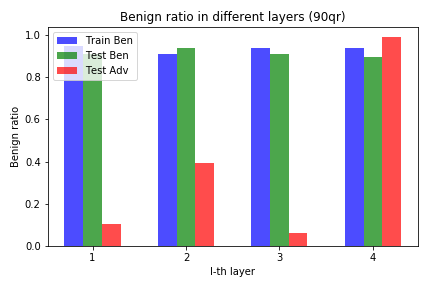
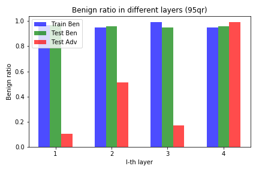
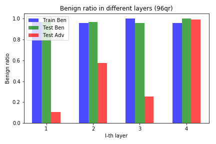
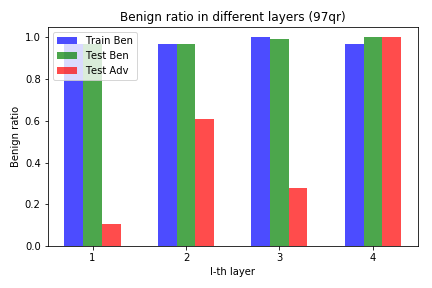
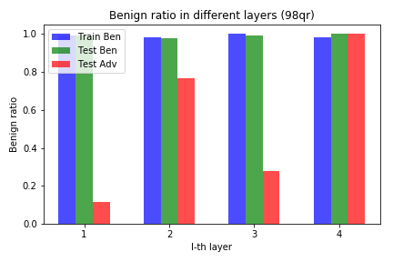
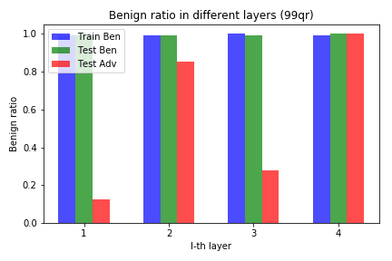
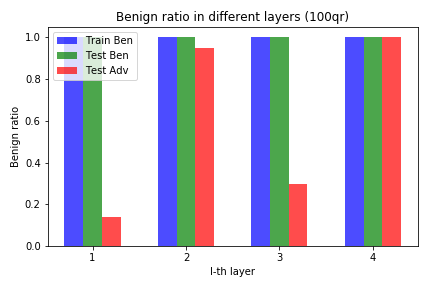

# Final Year Thesis
Final Year Thesis Project (COMP4981H) for Computer Science Students in HKUST

## Research on adversarial detection/robustification via LP (Layer Provenance)

  
Notations & Expressions

- **LP_i**: Layer Provenance of the i-th hidden layer
- **y**: ground-truth label, **y'** predicted label
- **S**: training set, **P**: provenance set
- **S1**: subset (first class) within training set, **S2**: subset (second class) within training set
- **P1**: subset (first class) within provenance set, **P2**: subset (second class) within provenance set
- **TPR**: True Positive Rate (A -> A)
- **TNR**: True Negative Rate (B -> B)
- **FPR**: False Positive Rate (B -> A)
- **FNR**: Flase Negative Rate (A -> B)
- **h**: Number of hidden layers (specifically for ReLU neural networks)
- **adv_a**: adversarial attack
- **i_FGSM**: Iterative Fast Gradient Sign Method, **JSMA**: Jacobian Saliency Map Attack, **CWL2**: CarliniWagner L2 Attack
- **()** indicate standard deviation. 

  
Common rules

- For Table 1 to 3 and Experiment 1 to 4TPR, TNR, FPR, and FNR are examinated on 100 samples. 
- For Table 1 to 3 and Experiment 1 to 4, the task is to classify 5 and 7 (subset of MNIST). 
- For Table 1 to 3 and Experiment 1 to 4, if we use more than one LP, we will concatenate all LPs as one LP.  

### ReLU 

**Experimental data collections (ReLU)**  

[Table 1: TPR & TNR by LP_1 (adv_a=i_FGSM)](pages/table1.md)

[Table 2: TPR & TNR by LP_i combinations (adv_a=i_FGSM, h=4, y/y'=y)](pages/table2.md)

[Table 3: TPR & TNR by input augmentation (adv_a=i_FGSM, LPs=1, y/y'=y)](pages/table3.md)

**Experiments  (ReLU)** 

[Exp 1: Relationship between h and FPR & FNR (adv_a=i_FGSM, LPs=1, y/y'=y)](pages/exp1.md)

[Exp 2: Relationship between |S| and FPR & FNR (adv_a=i_FGSM, LPs=1, y/y'=y)](pages/exp2.md)

[Exp 3: Relationship between single LP_i and FPR & FNR (adv_a=i_FGSM, y/y'=y)](pages/exp3.md)

[Exp 4: Relationship between LP_i combinations and FPR & FNR (adv_a=i_FGSM, y/y'=y)](pages/exp4.md)

  
Observations (ReLU)

  - Position of layers can influence detection capability. As we can see, when LP is closer to the end, TP  increases and TN decreases. One possible explanation is that when the LP is closer to the end, more samples (both for benign and adversarial samples) are likely to fall in the same provenance. 
  - Different type of layers also have different detection capability. 
  - We do not need to leverage all LPs. Single LP can achieve similar capability in terms of adversarial detection. 
  - If LP_i is matched, LP_i+1 is extremely likely to be matched.
  - An adversarial sample does not belong to either the provenance set of the ground-truth label or the provenance set of the predicted label
  - y' class, both benign & adversarial samples on 4 hidden layers ReLU → [A, B, B, B] or [A, A, B, B]
  - y class, most then [B, B, B, B] or [A, A, A, A]

### CNN

**Experiments (CNN)** 

  
Experiment 5: Potential Method 1 & Integrated LPs judgement (adv_attack=i_FGSM, y/y'=y', model=CNN)

 
  
    Note that LP_i = B if risk_score_i < differentitation_line_i
    
    LP_1, LP_2, and LP_3 are LPs for the convolutional layers; LP_4 is the LP for the first ReLU layer. 
  
  - If we intuitively set the differentiation lines and apply judgement rule (LP_1=A and LP_2=A) -> A, we can alreadly achieve 0% FPR and 13% FNR on CNN. 
  - What if we see the distribution of risk scores so as to deliberately select differentiation lines and adv condition?   Below figure represents the risk score distribution computed according to Potential Method 1. Even we only utilize LP_1 and set the differentiation line for LP_1 to be 300, it can differentiate all benign samples and most of adversarial samples.   If we deliberately set the differentation lines to be [300, 320, 100, \_] and apply judgement rule (LP_1=B and LP_2=B and LP_3=B) -> B, we can achieve 9.2% FPR and 3.2% FNR. 
   
  - What if we compare each LP_i between benign and adversarial samples? Below figure demonstrates that for LP_1, LP_2, and LP_3, we can clearly differentiate benign samples and adversarial samples. However, by Potential Method 1, we are not capable of reaching 0% FPR and 0% FNR.   Either FPR or FNR is 0%, then the other one will false error > 5%.  
  

  
Experiment 6: Potential Method 2 & Integrated LPs judgement (adv_attack=i_FGSM, y/y'=y', model=CNN)

 
  
    Note that LP_i = B if risk_score_i < differentitation_line_i
    
    LP_1, LP_2, and LP_3 are LPs for the convolutional layers; LP_4 is the LP for the first ReLU layer. 
  
  As shown in the following figures, it is difficult to tell that Potential Method 2 bring any improvement based to Potential Method 1. 
  
  

  LP_i risk score distribution with threshold=0.05 (i={1, 2, 3, 4}) 
  
  

  

  LP_i risk score distribution with threshold=0.1 (i={1, 2, 3, 4}) 
  
  

  

  LP_i risk score distribution with threshold=0.2 (i={1, 2, 3, 4}) 
  
  

  

  LP_i risk score distribution with threshold=0.3 (i={1, 2, 3, 4}) 
  
  

  

  LP_i risk score distribution with threshold=0.4 (i={1, 2, 3, 4}) 
  
  

  

  LP_i risk score distribution with threshold=0.5 (i={1, 2, 3, 4}) 
  
  

  

  LP_i risk score distribution with threshold=0.6 (i={1, 2, 3, 4}) 
  
  

  

  LP_i risk score distribution with threshold=0.7 (i={1, 2, 3, 4}) 
  
  

  

  LP_i risk score distribution with threshold=0.8 (i={1, 2, 3, 4}) 
  
  

  

  LP_i risk score distribution with threshold=0.9 (i={1, 2, 3, 4}) 
  
  

 

  
Experiment 7: Potential Method 3 & Integrated LPs judgement (adv_attack=i_FGSM, y/y'=y', model=CNN)

 
  
    Note that LP_i = B if B_log_prob_i > log_prob_diff_line_i
    
    LP_1, LP_2, and LP_3 are LPs for the convolutional layers; LP_4 is the LP for the first ReLU layer. 
    
  As shown in the following figures, we can observe that Potential Method 3 also achieve the same functionality to separate benign and adversarial samples as Potential Method 1. However, similar as Potential Method 1, we still not yet achieve 0% FPR and 0% FNR. 

  

  LP_i risk score distribution with |S|=1000 (i={1, 2, 3, 4}) 
  
  

  

  LP_i risk score distribution with |S|=5000 (i={1, 2, 3, 4}) 
  
  

  

  LP_i risk score distribution with |S|=10000 (i={1, 2, 3, 4}) 
  
  

  

  LP_i risk score distribution with |S|=15000 (i={1, 2, 3, 4}) 
  
  

  

  LP_i risk score distribution with |S|=20000 (i={1, 2, 3, 4}) 
  
  

  

  
Experiment 8: Potential Method 4 & Integrated LPs judgement (adv_attack=i_FGSM, y/y'=y', model=CNN)

 
  
    Note that LP_i = B if B_log_prob_i > log_prob_diff_line_i
    
    LP_1, LP_2, and LP_3 are LPs for the convolutional layers; LP_4 is the LP for the first ReLU layer. 
  
  As shown in the following figures, it is difficult to tell that Potential Method 4 bring any improvement based to Potential Method 3. 
  
  

  LP_i risk score distribution with delta=0.1 (i={1, 2, 3, 4}) 
  
  

  

  LP_i risk score distribution with delta=0.2 (i={1, 2, 3, 4}) 
  
  
  
  

  LP_i risk score distribution with delta=0.3 (i={1, 2, 3, 4}) 
  
  

  

  LP_i risk score distribution with delta=0.4 (i={1, 2, 3, 4}) 
  
  

  

  LP_i risk score distribution with delta=0.45 (i={1, 2, 3, 4}) 
  
  

  

  
Experiment 9: Relation between percentile (PCTL/qr) differentation line and 'Classified Benign Ratio' (CBR) (adv_attack=i_FGSM, y/y'=y', model=CNN)

   
  

  CBR in LP_i layer with <b>qr=0.90</b> (i={1, 2, 3, 4})  
    
  Input | CBR_L1 | CBR_L2 | CBR_L3 | CBR_L4 
  --- | --- | --- | --- | --- 
  Train dataset (benign) | 0.94949495 | 0.90909091 | 0.93939394 | 0.93939394
  Test dataset (benign) | 0.90816327 | 0.93877551 | 0.90816327 | 0.89795918
  Test dataset (adv) | 0.10638298 | 0.39361702 | 0.06382979 | 0.9893617
    
  
  

   
  

  CBR in LP_i layer with <b>qr=0.95</b> (i={1, 2, 3, 4})  
    
  Input | CBR_L1 | CBR_L2 | CBR_L3 | CBR_L4 
  --- | --- | --- | --- | --- 
  Train dataset (benign) | 0.96969697 | 0.94949495 | 0.98989899 | 0.94949495
  Test dataset (benign) | 0.96938776 | 0.95918367 | 0.94897959 | 0.95918367
  Test dataset (adv) | 0.10638298 | 0.5106383 | 0.17021277 | 0.9893617
    
  
  

   
  

  CBR in LP_i layer with <b>qr=0.96</b> (i={1, 2, 3, 4})  
    
  Input | CBR_L1 | CBR_L2 | CBR_L3 | CBR_L4 
  --- | --- | --- | --- | --- 
  Train dataset (benign) | 0.96969697 | 0.95959596 | 1.0 | 0.95959596
  Test dataset (benign) | 0.96938776 | 0.96938776 | 0.95918367 | 1.0
  Test dataset (adv) | 0.10638298 | 0.57446809 | 0.25531915 | 0.9893617
    
  
  

   
  

  CBR in LP_i layer with <b>qr=0.97</b> (i={1, 2, 3, 4})  
    
  Input | CBR_L1 | CBR_L2 | CBR_L3 | CBR_L4 
  --- | --- | --- | --- | --- 
  Train dataset (benign) | 0.96969697 | 0.96969697 | 1.0 | 0.96969697
  Test dataset (benign) | 0.96938776 | 0.96938776 | 0.98979592 | 1.0
  Test dataset (adv) | 0.10638298 | 0.60638298 | 0.27659574 | 1.0
    
  
  

   
  

  CBR in LP_i layer with <b>qr=0.98</b> (i={1, 2, 3, 4})  
    
  Input | CBR_L1 | CBR_L2 | CBR_L3 | CBR_L4 
  --- | --- | --- | --- | --- 
  Train dataset (benign) | 0.98989899 | 0.97979798 | 1.0 | 0.97979798
  Test dataset (benign) | 0.98979592 | 0.97959184 | 0.98979592 | 1.0
  Test dataset (adv) | 0.11702128 | 0.76595745 | 0.27659574 | 1.0
    
  
  

   
  

  CBR in LP_i layer with <b>qr=0.99</b> (i={1, 2, 3, 4})  
    
  Input | CBR_L1 | CBR_L2 | CBR_L3 | CBR_L4 
  --- | --- | --- | --- | --- 
  Train dataset (benign) | 0.98989899 | 0.98989899 | 1.0 | 0.98989899
  Test dataset (benign) | 0.98979592 | 0.98979592 | 0.98979592 | 1.0
  Test dataset (adv) | 0.12765957 | 0.85106383 | 0.27659574 | 1.0
    
  
  

   
  

  CBR in LP_i layer with <b>qr=1.00</b> (i={1, 2, 3, 4})  
    
  Input | CBR_L1 | CBR_L2 | CBR_L3 | CBR_L4 
  --- | --- | --- | --- | --- 
  Train dataset (benign) | 1.0 | 1.0 | 1.0 | 1.0
  Test dataset (benign) | 1.0 | 1.0 | 1.0 | 1.0
  Test dataset (adv) | 0.13829787 | 0.94680851 | 0.29787234 | 1.0
    
  
  

 

  
Experiment 10: Relation between PIs and dropout layer (adv_attack=i_FGSM, y/y'=y', model=CNN, qr=95, i-th_robustified_layer=2, approach=insertion and total retraining)

     Below two figures: original CNN model without any robustification
     -> We select to insert a dropout layer before 2nd layer to see whether there is any improvement
     -> Our objective is to observe that benign sampeles are high (most of them are recognized as benign) and adversarial samples are low (vice versa)
  
 
 
 
     Below figures: robustified models with various dropout rate
          
 
 
  
 
 
 
 
 
 
 
 
 
 
 
 
 
 
 
 
 
 
 
 
 

  
Experiment 11: Relation between PIs and dropout layer (adv_attack=i_FGSM, y/y'=y', model=CNN, qr=95, i-th_robustified_layer=1/3/4, approach=insertion and total retraining)

  
     Due to unsatisfied results of Exp 10, we would like to examinate what if we increase the dropout rate on other layers. 
     Below are diagrams to indicate influence of dropout layer before the first/third/fourth layer. 
     
     Before the first layer 
     
 
  
 
 
 
 
 
   
 
 
 
 
 
 
 
 
 

 
 
 
 
 
     
     Before the third layer 
     
 
  
 
 
 
 
 
   
 
 
 
 
 
 
 
 
 

 
 
 
 
 
     
     Before the fourth layer 
     
 
  
 
 
 
 
 
   
 
 
 
 
 
 
 
 
 

 
 
 
 
 
 
     Current Conclusion (2019 Dec. 3): increasing dropout will make benign and adversarial samples further indistinguishable!!
     It is also noticable that the weights of training and evaluating of models (which involve dropout layer) are different. 
     

  
Experiment 12:Relation between PIs and dropout layer (adv_attack=i_FGSM, y/y'=y', model=CNN, qr=95, approach=insertion only)

  
     Before the first layer 
     
 
  
 
 
  
 
 
 
 
 
 
 
 
 
 
 
 
 
 
 
 
 
 
 
      Before the second layer 
     
 
  
 
 
  
 
 
 
 
 
 
 
 
 
 
 
 
 
 
 
 
 
 
 
      Before the third layer 
     
 
  
 
 
  
 
 
 
 
 
 
 
 
 
 
 
 
 
 
 
 
 
 
 
       Before the fourth layer 
     
 
  
 
 
  
 
 
 
 
 
 
 
 
 
 
 
 
 
 
 
 
 
 
 

  
Experiment 13: Relation between PIs and dropout layer (adv_attack=i_FGSM, y/y'=y', model=CNN, qr=95, approach=insertion and slight tuning)

  
     Before the first layer 
     
 
 

 
  
 
 
  
 
 
  
 
 
  
 
 
  
 
 
  
     
 
  
 
     Before the second layer 
     
 
 

 
  
 
 
  
 
 
  
 
 
  
 
 
  
 
 
  
     
 
   
 
     Before the third layer 
     
 
 

 
  
 
 
  
 
 
  
 
 
  
 
 
  
 
 
  
     
 
   
 
     Before the fourth layer 
     
 
 

 
  
 
 
  
 
 
  
 
 
  
 
 
  
 
 
  
     
 
   
 

  
(PENDING) Experiment ??: Does the decrease of CBR in certain layer bring decrease in the subsequent layers?(adv_attack=i_FGSM, y/y'=y', model=CNN, qr=95)

  
    Based on exp10, it seems that L2 and L4 is relatively vulnerable compared to L1 and L3
    Can robustify L2 indirectly also robustify L4? 
    Will the decrease of CBR L2 cause the subsequent decrease of CBR L4?
  

**Observations (CNN)**  
- (to be updated)

### To-Do List 

Top Priority (most urgent)
- Separate contents as individual pages instead toggle lists （Also organize README page a bit)
- Include more information needed

High Priority
- <b>(Wokring) Investigate whether most of adversarial samples fall into the same provenance. If it is the case, maybe we can remove the provenance where adversarial samples are potential to match -> draw a graph to demonstrate the result</b>
- Consider leverage the concept of conditional probability 
- Try One-class SVM (OSVM)
- Experiment on widely-adopted models 
- Store part of trained models as 'h5' format to preserve reproducibility

Low Priority
- Unify the format of citations
- Enlarge the table to include 0qr(min)/1qr/2qr(medium)/3qr/4qr(max)
- Document down the model architectures 

## Appendix 

#### Appendix 1.1 Architectures 

  
Architectures of models (all ReLU networks)

  
  Jotting for architectures (More specification illustration required)
  - 784 64 2 (1)
  - 784 64 10 2 (2)
  - 784 64 32 10 2 (3)
  - 784 64 32 20 10 2 (4)
  

  
Architectures of models (all CNN networks)

  
  (more)
  

  
List of widely-adopted networks examinated

  
  (more)
  

#### Appendix 1.2 Original Rule-based Method & 4 potential improvements 

Note that all mathematical formulas are written for <b>only a layer</b> in a given neural network instead of the whole neural network.  

  
  
Original Rule-based Method: Determine whether the provenance of input is learned

  
  

  
  
Potential Method 1: Compute SP (Sample Probability) for each neuron & Determine whether l1-distance between SP(LP) and provenance of input is close enough

  
  

  
  
Potential Method 2: Compute SP (Sample Probability) for each neuron & Determine whether l1-distance between SP(LP) and provenance of input is close enough, where we filter out neurons that is relatively close (< beta).

  
  

  
  
Potential Method 3: Compute the probability that each neuron to be benign & Multiple all probabilities of neurons to determine whether a given input is benign/adversarial by a probability threshold value.

  
  

  
  
Potential Method 4: Compute the probability that each neuron to be benign & Multiple all probabilities of neurons to determine whether a given input is benign/adversarial by a probability threshold value, where we filter out neurons with probabilities relatively ambigious (e.g., 0.3 - 0.7)

  

#### Appendix 1.3 Interesting Trials 

Use **probability absolute difference method** instead of rule-based (belonging judgement) method. 

\|S\| | \|S1\|/\|S2\| | \|P1\| | \|P2\| | TNR | TPR | LP(s) | h | alpha 
--- | --- | --- | --- | --- | --- | --- | --- | ---
3000 | 1364/1636 | 495.060 (128.945) | 616.210 (163.089) | 83.4 (10.4)% | 96.6 (5.7)% | 1 | 4 | 10

## References 
[1] Florian Tramer, Nicolas Papernot, Ian Goodfellow, Dan Boneh, and Patrick McDaniel. The space of transferable adversarial examples. arXiv preprint arXiv:1704.03453, 2017.  
[2] Ilyas, A., Santurkar, S., Tsipras, D., Engstrom, L., Tran, B., and Madry, A. Adversarial examples are not bugs, they are features. arXiv preprint arXiv:1905.02175, 2019.  
[3] Ma, X., Li, B., Wang, Y., Erfani, S. M., Wijewickrema, S., Schoenebeck, G., Houle, M. E., Song, D., and Bailey, J. Characterizing adversarial subspaces using local intrinsic dimensionality.  
[4] Mahloujifar, S., Zhang, X., Mahmoody, M., and Evans, D. Empirically measuring concentration: Fundamental limits on intrinsic robustness. Safe Machine Learning workshop at ICLR, 2019.  
[5] Divya Gopinath, Hayes Converse, Corina S. Pasareanu, and Ankur Taly. Property Inference for Deep Neural Networks. ASE, 2019.  
[6] NIC.  
[7] Exploiting the Inherent Limitation of L0 Adversarial Examples  
