# Final Year Thesis
Final Year Thesis Project (COMP4981H) for Computer Science Students in HKUST

## Research Questions (RQs)

### RQ1: Can we design a metric to approximate the adversarial robustness efficiently?  

#### _Approach 1: Directly estimate the training dataset_ 

There are related papers, which aim to define (theoretical) metrix that highly correlated to robustness. I place description of relevant work in Appendix 1.1. 

**Notations**  

  - The metric for adversarial robustness approximation is denoted as ***static estimation of adversarial risk***, 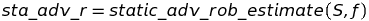, where 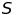 and 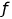 indicate the training dataset and neural network trained. 
  - For each pair of machine learning models (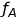, 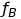), they are trained on individual datasets 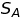 and 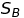.
  
**Mathematical definition for** 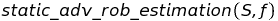 **function**  

  - 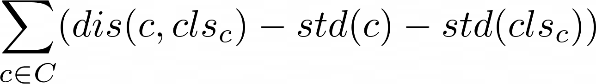
  
**Purpose of experiments**  

  - For each pair of machine learning models (, ), we would like to experiment whether the relationship between 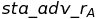 and  can indicate the relationship between actual adversarial robustness 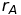 and 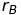 (against state-of-art adversarial attacks).   For instance, if  < , we expect to observe attack success rate on  is higher than that of .
  - Indicator function: 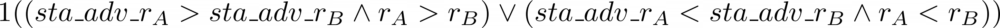
  
#### Multimedia classification task, MNIST

Experimental Settings | Match ratio | Time (sta_adv_r) | Time(r) | # of pairs | size(S) | Attack | Defense | eps
--- | --- | --- | --- |--- |--- |--- |--- |--- 
Trail 1 | 0.7000 | 0.00528 | 0.43242 | 100 | 600 | FGSM | None | 0.001  

Implementation Details:
1. Number of samples used for computing attack success rate: 1000
2. Architecture: Two layer (one hidden layer) ReLU (fully-connected) neural netowrk  
3. FGSM is generated according to the [Pytorch Official Website](https://pytorch.org/tutorials/beginner/fgsm_tutorial.html). For more effective attacks, I will conduct those once I receive the accessibility of hardware resource. 
4. Actuacl robustness is calculated by 1 - attack sucess rate 
5. Both  and  are trained by the same architecture (include preprocess and activation functions). 

Next Steps: 
1. **(Running Experiment)** Measure on a set of architectures (Compare distribution instead of applying indicator function)
2. Use statistical approach (e.g., null test) instead of simple match ratio

Discussion: 
1. Design a dataset to have high sta_adv_r and another dataset to have low std_adv_r (Completed, but not actually meaningful) 
2. How to become more 'software-enginnering'?

#### _Approach 2: Leverage preconditions for the prediction postcondition in adversarial detection [5]_

#### Binary classification task (5 vs 7)

**Notations**  

- Training set: 
- Subset (first class) of training set: S5
- Subset (second class) of training set: S7
- Precondition set: P
- Subset (first class) of precondition set: P5
- Subset (second class) of precondition set: P7

  
Table 1: Detection via input preconditions on 1-4 hidden layer ReLU network

  ## 

  \|S\| | \|S5\|/\|S7\| | \|P5\| | \|P7\| | 1 - FPR | 1 - FNR | Input Augmentation | num of hidden layers
  --- | --- | --- | --- | --- | --- | --- | ---
  500 | 227/273 | 70.850 (9.358) | 121.430 (15.163) | 64.0 (4.3)% | 34.5 (21.7)% | None | 1
  500 | 227/273 | 99.480 (21.718) | 141.360 (29.135) | 59.1 (9.2)% | 43.2 (21.9)% | None | 2
  500 | 227/273 | 103.550 (17.698) | 129.930 (26.887) | 59.9 (7.1)% | 70.0 (23.9)% | None | 3 
  500 | 227/273 | 96.940 (19.057) | 110.090 (29.264) | 65.1 (7.3)% | 72.9 (20.9)% | None | 4
  1500 | 674/826 | 162.900 (24.819) | 223.570 (38.956) | 79.7 (4.3)% | 65.2 (16.1)% | None | 1
  1500 | 674/826 | 200.250 (52.630) | 262.800 (58.982) | 77.7 (5.8)% | 79.9 (19.8)% | None | 2
  1500 | 674/826 | 202.130 (59.237) | 301.580 (82.210) | 73.5 (6.7)% | 98.3 (3.1)% | None | 3
  1500 | 674/826 | 212.660 (57.575) | 279.020 (71.900) | 74.2 (6.6)% | 98.5 (3.8)% | None | 4
  3000 | 1364/1636 | 432.980 (93.588) | 738.560 (175.844) | 68.8 (6.5)% | 98.2 (3)% | None | 1
  3000 | 1364/1636 | 463.520 (100.624) | 674.400 (170.379) | 71.4 (6.6)% | 99.1 (2.1)% | None | 2
  3000 | 1364/1636 | 506.940 (127.957) | 674.990 (182.066) | 69.5 (7.2)% | 99.9 (0.5)% | None | 3
  3000 | 1364/1636 | 490.720 (141.795) | 596.430 (180.541) | 71.9 (7.7)% | 99.9 (0.6)% | None | 4
  
  \|S\| | \|S5\|/\|S7\| | \|P5\| | \|P7\| | 1 - FPR | 1 - FNR | Property layer(s) | num of hidden layers
  --- | --- | --- | --- | --- | --- | --- | ---
  500 | 227/273 | 96.940 (19.057) | 110.090 (29.264) | 65.1 (7.3)% | 72.9 (20.9)% | 1 | 4
  500 | 227/273 | 99.160 (22.821) | 114.030 (29.648) | 64.0 (8.9)% | 75.8 (21.2)% | 1/2 | 4
  500 | 227/273 | 95.820 (25.080) | 108.020 (28.359) | 65.8 (9.0)% | 75.8 (21.4)% | 1/2/3 | 4
  500 | 227/273 | 99.030 (22.518) | 109.370 (28.731) | 64.6 (8.4)% | 74.3 (21.7)% | 1/2/3/4 | 4
  500 | 227/273 | 95.370 (23.317) | 111.200 (27.613) | 64.3 (8.6)% | 78.0 (19.9)% | 1/4 | 4
  500 | 227/273 | 14.300 (7.176) | 17.490 (7.640) | 96.1 (2.7)% | 30.1 (38.9)% | 2 | 4
  500 | 227/273 | 6.470 (2.364) | 5.890 (2.391) | 98.0 (2.2)% | 34.6 (37.2)% | 3 | 4
  500 | 227/273 | 3.890 (1.280) | 3.760 (1.320) | 97.8 (2.3)% | 46.6 (38.5)% | 4 | 4
  1500 | 674/826 | 212.660 (57.575) | 279.020 (71.900) | 74.2 (6.6)% | 98.5 (3.8)% | 1 | 4
  1500 | 674/826 | 208.290 (54.358) | 279.900 (84.229) | 74.3 (7.0)% | 98.6 (3.5)% | 1/2 | 4
  1500 | 674/826 | 205.810 (60.844) | 266.870 (80.710) | 74.8 (6.8)% | 98.9 (2.9)% | 1/2/3 | 4
  1500 | 674/826 | 210.150 (61.196) | 292.730 (91.176) | 73.5 (6.8)% | 99.0 (2.3)% | 1/2/3/4 | 4
  1500 | 674/826 | 208.620 (65.275) | 281.800 (80.535) | 74.2 (6.9)% | 98.4 (4.4)% | 1/4 | 4
  1500 | 674/826 | 19.280 (10.573) | 19.450 (9.583) | 97.9 (1.3)% | 76.0 (35.1)% | 2 | 4
  1500 | 674/826 | 6.460 (3.667) | 6.780 (3.657) | 99.5 (0.8)% | 56.3 (44.0)% | 3 | 4
  1500 | 674/826 | 3.260 (1.906) | 3.240 (1.550) | 99.5 (0.7)% | 74.2 (33.3)% | 4 | 4
  3000 | 1364/1636 | 490.720 (141.795) | 596.430 (180.541) | 71.9 (7.7)% | 99.9 (0.6)% | 1 | 4
  3000 | 1364/1636 | 514.680 (125.926) | 612.620 (189.286) | 70.5 (7.4)% | 100.0 (0.2)% | 1/2 | 4
  3000 | 1364/1636 | 521.110 (139.460) | 586.970 (179.797) | 71.1 (7.0)% | 100.0 (0.2)% | 1/2/3 | 4 
  3000 | 1364/1636 | 479.630 (127.896) | 590.500 (163.437) | 73.0 (6.9)% | 99.9 (0.3)% | 1/2/3/4 | 4
  3000 | 1364/1636 | 25.500 (15.411) | 24.680 (14.115) | 98.8 (1.1)% | 81.8 (27.6)% | 2 | 4
  3000 | 1364/1636 | 5.510 (4.001) | 5.120 (3.179) | 99.8 (0.5)% | 88.8 (23.8)% | 3 | 4
  3000 | 1364/1636 | 5.510 (4.001) | 5.120 (3.179) | 99.8 (0.5)% | 88.8 (23.8)% | 4 | 4 (working)
  3000 | 1364/1636 | 5.510 (4.001) | 5.120 (3.179) | 99.8 (0.5)% | 88.8 (23.8)% | 1/4 | 4 (working)
  

  
Table 2: Detection via input preconditions on 1 hidden layer ReLU network (with data augmentation)

  ## 
  
  \|S\| | \|S5\| | \|S7\| | \|P5\| | \|P7\| | 1 - FPR | 1 - FNR | Input Augmentation
  --- | --- | --- | --- | --- | --- | --- | ---  
  500 | 227 | 273 | 70.850 (9.358) | 121.430 (15.163) | 64.0 (4.3)% | 34.5 (21.7)% | None 
  3000 (500+2500) | 1362 | 1638 | 289.090 (24.717) | 644.110 (51.828) | 68.0 (3.5)% | 17.5 (12.0)% | Yes (Approach1)
  3000 (500+2500) | 1362 | 1638 | 365.170 (40.151) | 742.320 (93.065) | 68.3 (3.6)% | 14.8 (10.5)% | Yes (Approach2)
  1500 | 674 | 826 | 162.900 (24.819) | 223.570 (38.956) | 79.7 (4.3)% | 65.2 (16.1)% | None
  9000 (1500+7500) | 4044 | 4956 | 574.650 (82.479) | 1090.800 (186.220) | 83.7 (3.6)% | 52.4 (17.2)% | Yes (Approach1)
  9000 (1500+7500) | 4044 | 4956 | 682.920 (102.169) | 1378.340 (216.134) | 84.8 (3.4)% | 45.9 (15.8)% | Yes (Approach2)
  3000 | 1364 | 1636 | 432.980 (93.588) | 738.560 (175.844) | 68.8 (6.5)% | 98.2 (3)% | None 
  18000 (3000+15000) | 8185 | 9815 | 1226.650 (331.550) | 3299.600 (682.530) | 74.5 (5.8)% | 92.7 (6.7)% | Yes (Approach1)
  18000 (3000+15000) | 8185 | 9815 | 1548.330 (359.290) | 3975.600 (833.274) | 74.7 (5.5)% | 89.2 (8.3)% | Yes (Approach2)
  

  
Table 3: Detection via input preconditions on 2 hidden layer ReLU network (with data augmentation)

  ## 

  \|S\| | \|S5\| | \|S7\| | \|P5\| | \|P7\| | 1 - FPR | 1 - FNR | Input Augmentation
  --- | --- | --- | --- | --- | --- | --- | ---  
  500 | 227 | 273 | 99.480 (21.718) | 141.360 (29.135) | 59.1 (9.2)% | 43.2 (21.9)% | None 
  3000 (500+2500) | 1362 | 1638 | 272.770 (63.876) | 469.120 (152.296) | 69.3 (7.3)% | 28.2 (16.0)% | Yes (Approach1)
  3000 (500+2500) | 1362 | 1638 | 338.890 (97.934) | 584.250 (181.626) | 68.0 (8.8)% | 28.2 (14.9)% | Yes (Approach2)
  1500 | 674 | 826 | 200.250 (52.630) | 262.800 (58.982) | 77.7 (5.8)% | 79.9 (19.8)% | None 
  9000 (1500+7500) | 4044 | 4956 | 524.450 (161.528) | 914.390 (239.864) | 82.9 (5.3)% | 64.7 (22.9)% | Yes (Approach1)
  9000 (1500+7500) | 4044 | 4956 | 651.990 (205.734) | 1189.720 (363.669) | 82.9 (5.8)% | 58.7 (19.8)% | Yes (Approach2)
  3000 | 1364 | 1636 | 463.520 (100.624) | 674.400 (170.379) | 71.4 (6.6)% | 99.1 (2.1)% | None
  18000 (3000+15000) | 8185 | 9815 | 1205.820 (332.480) | 2549.280 (701.297) | 76.0 (6.3)% | 95.6 (6.9)% | Yes (Approach1)
  18000 (3000+15000) | 8185 | 9815 | 1427.990 (383.569) | 3360.290 (995.905) | 76.0 (7.4)% | 91.7 (8.3)% | Yes (Approach2)

Implementation Deatils:
1. All bengin and adversarial samples are generated according to MNIST dataset (size of 100)
2. Values in () indicate standard deviation 
3. Approach1 - append noise _~Uniform(lower_bound=-0.1, uppper_bound=0.1)_; 5 perturbed inputs are generated per input 
4. Approach2 - append noise _~Normal(mean=0, std=0.1)_; 5 perturbed inputs are generated per input 
5. Architecture: Two layer (one hidden layer) ReLU (fully-connected) neural netowrk  
6. Attack: iterative FGSM (attack until the perturbed input is misclassified)

Interesting Observations

  
Experiment 1: Relationship between the complexity (depth) of ReLU neural networks and detection performance (FPR & FNR)

  
  Note that only leverage the first ReLU layer, which consists of 64 neurons for all models. 

  

  FPR & FNR of adversarial detection among ReLU neural networks with various depth (|S| = 500) 
  

  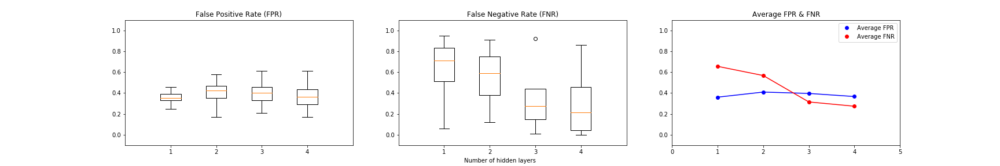
  

  FPR & FNR of adversarial detection among ReLU neural networks with various depth (|S| = 1500) 
  

  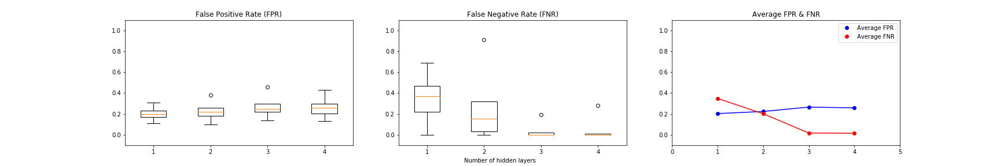
  

  FPR & FNR of adversarial detection among ReLU neural networks with various depth (|S| = 3500) 
  

  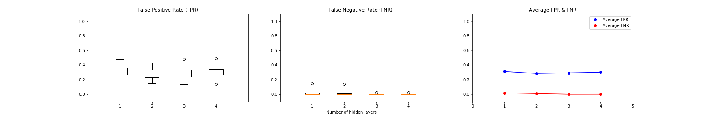
  

  
Experiment 2: Relationship between the size of training set and detection performance (FPR & FNR)

  
  

  FPR & FNR of adversarial detection among ReLU neural networks trained with various |S| (# of hidden layers = 1) 
  

  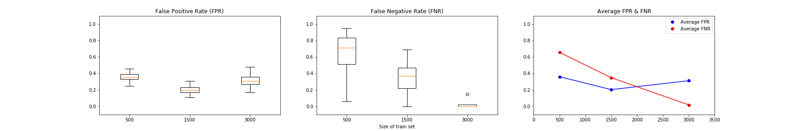
  

  FPR & FNR of adversarial detection among ReLU neural networks trained with various |S| (# of hidden layers = 2) 
  

  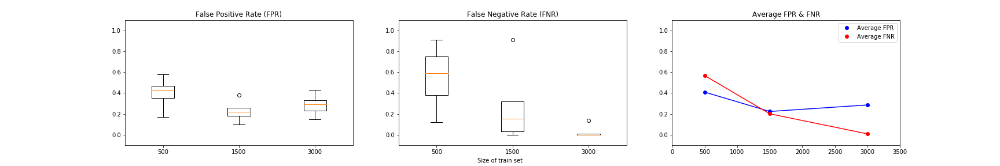
  

  FPR & FNR of adversarial detection among ReLU neural networks trained with various |S| (# of hidden layers = 3) 
  

  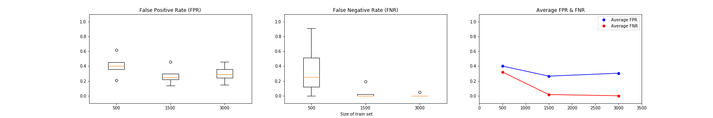
  

  FPR & FNR of adversarial detection among ReLU neural networks trained with various |S| (# of hidden layers = 4) 
  

  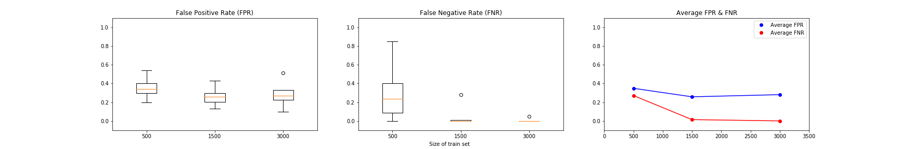  
  

  
Experiment 3: Case study on multiple hidden layers ReLU neural networks

  
  Do we actually need to use every layer to achieve promising AEDR (Adversarial Example Detection Rate)? 
  - Based on 4 hidden layers networks, investigate the performance by using different combination of layer provenance. 
  - l1, l1+l2, l1+l2+l3, l1+l2+l3+l4, l2, l2+l3, ...
  

  
Experiment 4: Case study on convolutional network

  
  (study NIC on CNN)
  

Trivial
- None

To-Do 
- Update all h=3 & h=4
- Update all figures in exp1 and exp2
- CNN 
- Conduct experiments on 10-classes 
- Consider the correlation between size of |P5| and |P7| with (1_FPR) and (1-FNR)
- Augmentation of train dataset vs distribution of FPR and FNR
- Unify the format of citations
- Enlarge the table to include 0qr(min)/1qr/2qr(medium)/3qr/4qr(max)
- Experiment on widely adopted DNN

Suggestions from Victor:
- What is the advantages of my implementation over NIC?

Jotting for architectures (Move them to appendix in the future)
- 784 64 2 (1)
- 784 64 10 2 (2)
- 784 64 32 10 2 (3)
- 784 64 32 20 10 2 (4)

## Appendix 

#### Appendix 1.1 
Here we list out self-defined (related to our work) metrics that are correlated to (adversarial) robustness. 

1. Dimensionality [1]
2. Distance to decision boundary (in various directions like benign, adversarial, random)
3. Non-robust features [2]
4. Local intrinsic dimensionality [3]
5. Adversarial risk by the concentration of measure [4]

## References 

[1] Florian Tramer, Nicolas Papernot, Ian Goodfellow, Dan Boneh, and Patrick McDaniel. The space of transferable adversarial examples. arXiv preprint arXiv:1704.03453, 2017.  
[2] Ilyas, A., Santurkar, S., Tsipras, D., Engstrom, L., Tran, B., and Madry, A. Adversarial examples are not bugs, they are features. arXiv preprint arXiv:1905.02175, 2019.  
[3] Ma, X., Li, B., Wang, Y., Erfani, S. M., Wijewickrema, S., Schoenebeck, G., Houle, M. E., Song, D., and Bailey, J. Characterizing adversarial subspaces using local intrinsic dimensionality.  
[4] Mahloujifar, S., Zhang, X., Mahmoody, M., and Evans, D. Empirically measuring concentration: Fundamental limits on intrinsic robustness. Safe Machine Learning workshop at ICLR, 2019.  
[5] Divya Gopinath, Hayes Converse, Corina S. Pasareanu, and Ankur Taly. Property Inference for Deep Neural Networks. ASE, 2019.  
[6] NIC.  
[7] Exploiting the Inherent Limitation of L0 Adversarial Examples  
