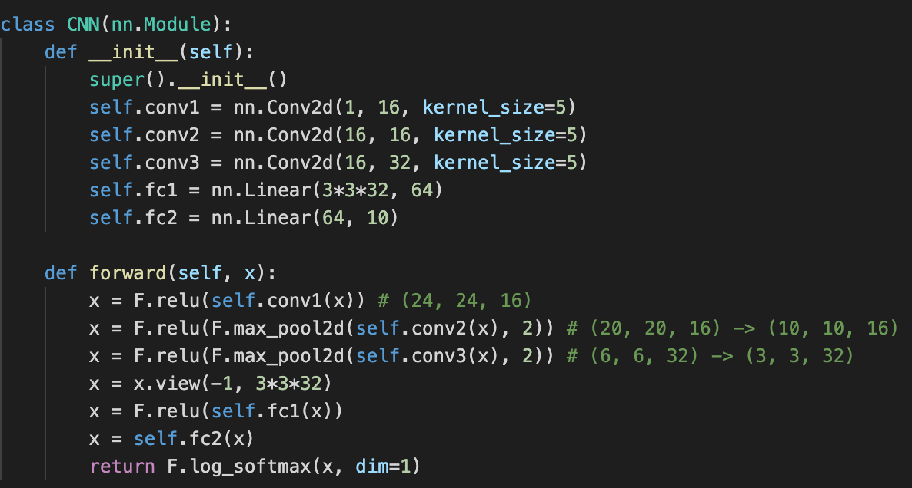
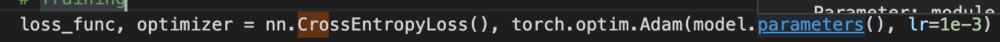

  
Architectures of models (all ReLU networks)

  
  Jotting for architectures (More specification illustration required)
  - 784 64 2 (1)
  - 784 64 10 2 (2)
  - 784 64 32 10 2 (3)
  - 784 64 32 20 10 2 (4)
  

  
Architectures of models (all CNN networks)

  
  
  
  

  
List of widely-adopted networks examinated

  
  (more)
  

