    Experiment 10: Relation between PIs and dropout layer (adv_attack=i_FGSM, y/y'=y', model=CNN, qr=95, i-th_robustified_layer=2, approach=insertion and total retraining)

    Below two figures: original CNN model without any robustification
    -> We select to insert a dropout layer before 2nd layer to see whether there is any improvement
    -> Our objective is to observe that benign sampeles are high (most of them are recognized as benign) and adversarial samples are low (vice versa)

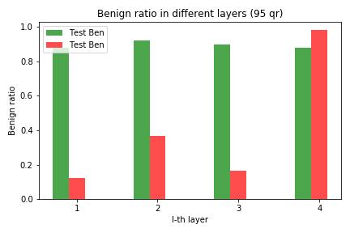
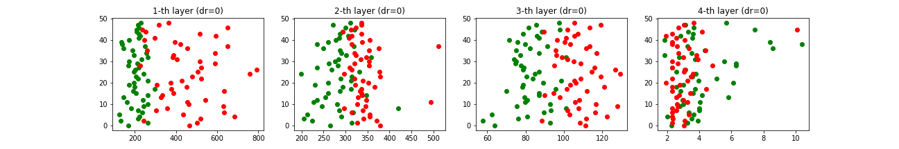

    Below figures: robustified models with various dropout rate
        

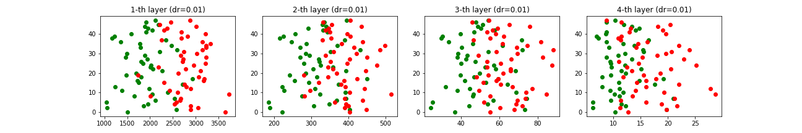

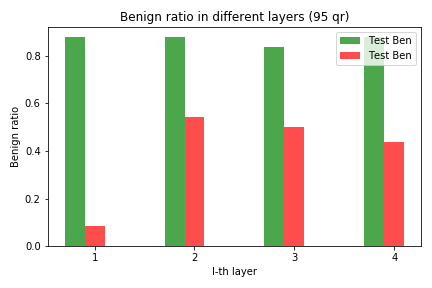
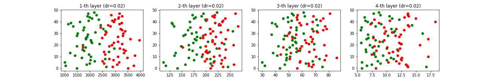

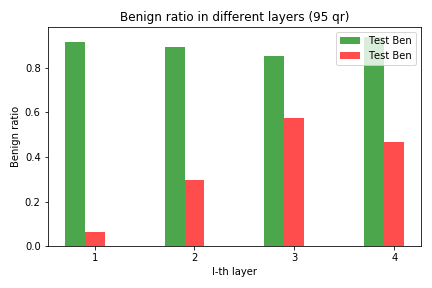
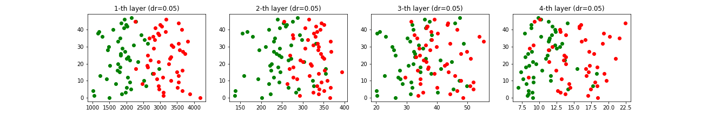

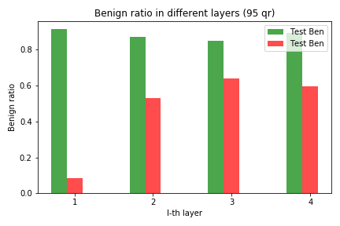
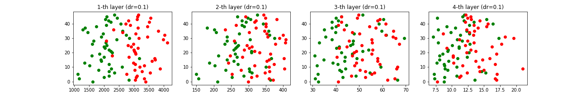

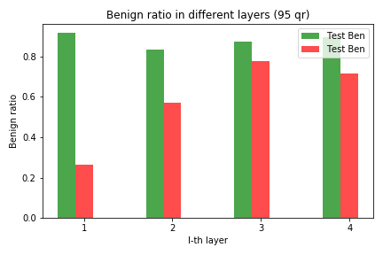
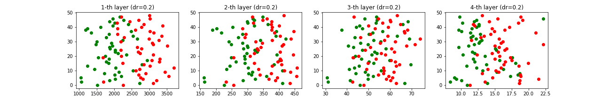

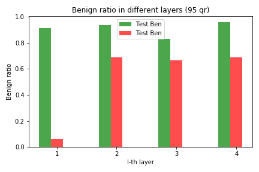
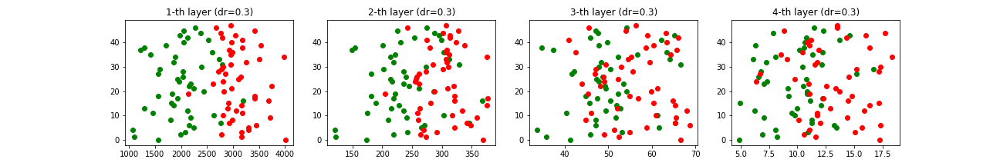

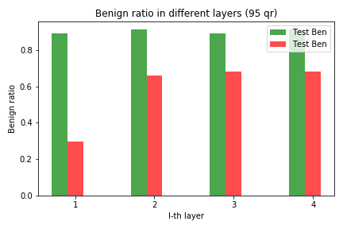
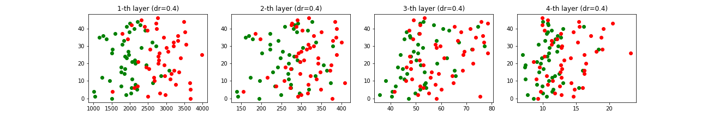

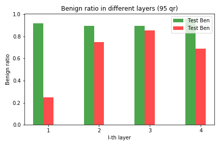
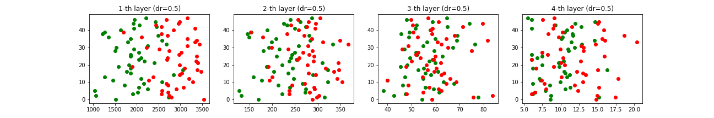

