    Experiment 11: Relation between PIs and dropout layer (adv_attack=i_FGSM, y/y'=y', model=CNN, qr=95, i-th_robustified_layer=1/3/4, approach=insertion and total retraining)

  
    Due to unsatisfied results of Exp 10, we would like to examinate what if we increase the dropout rate on other layers. 
    Below are diagrams to indicate influence of dropout layer before the first/third/fourth layer. 
    
    Before the first layer 
    
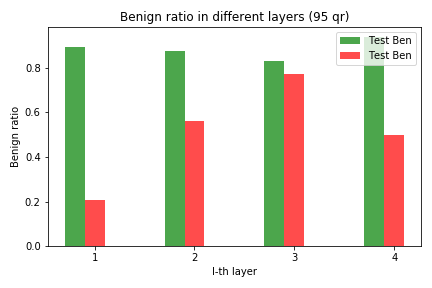
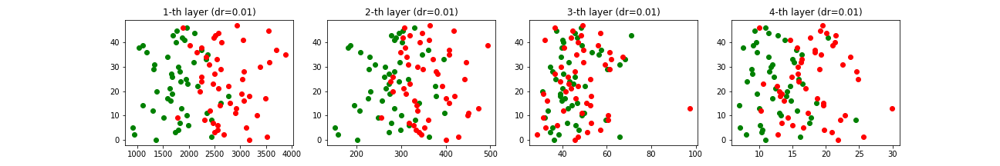 

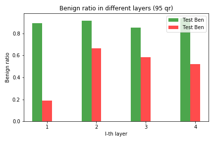
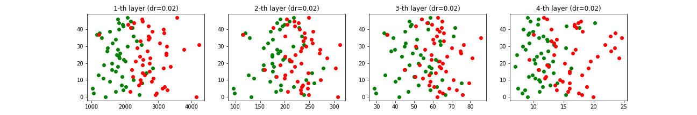

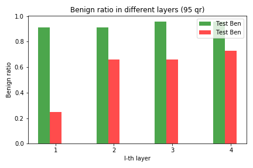
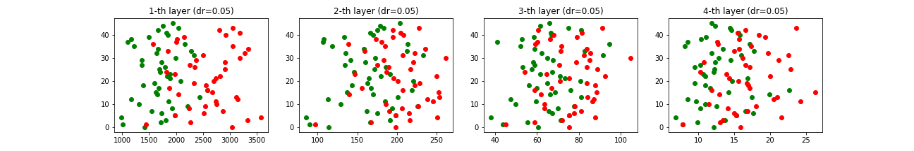  

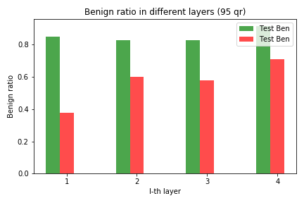
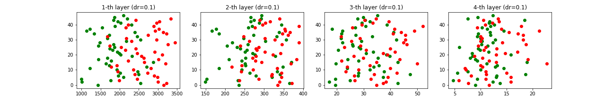

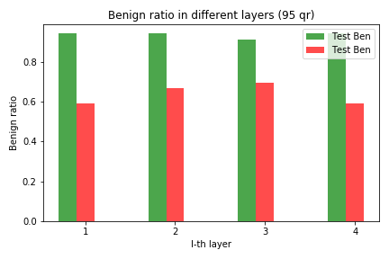
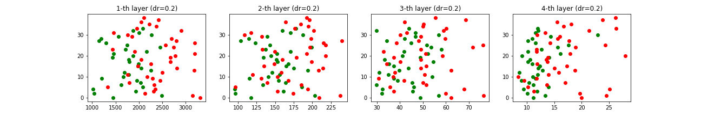

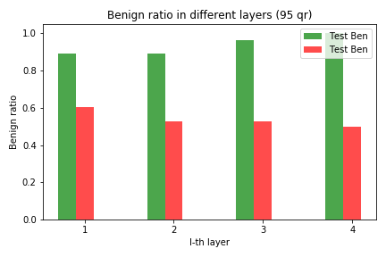
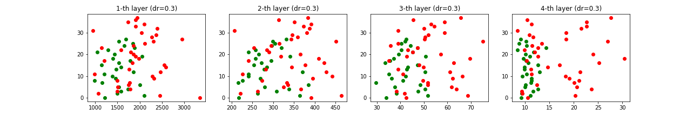

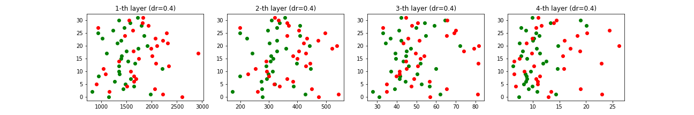

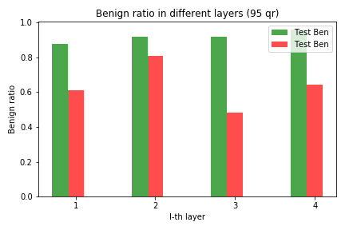
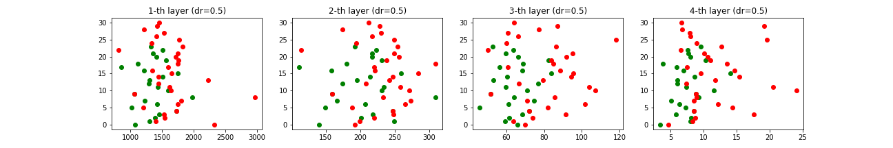
    
    Before the third layer 
    
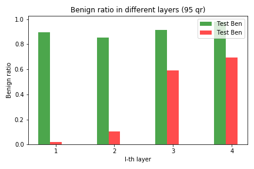
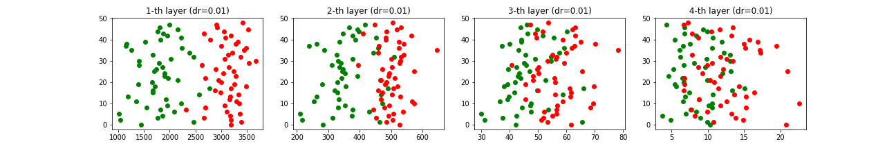 

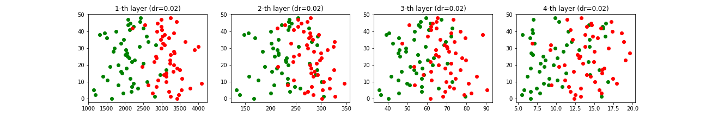

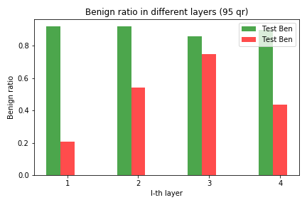
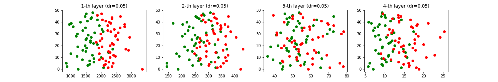  

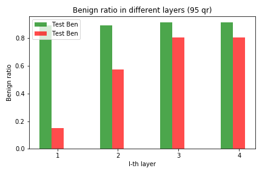
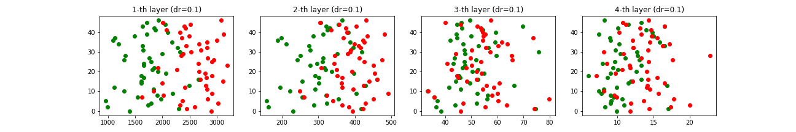

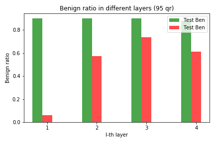
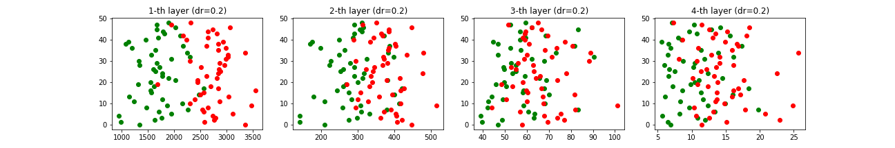

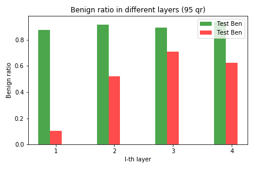
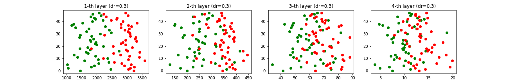

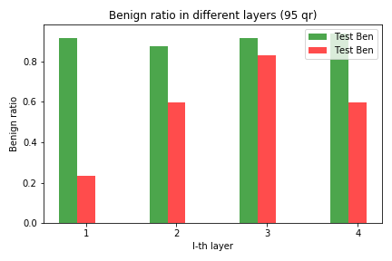
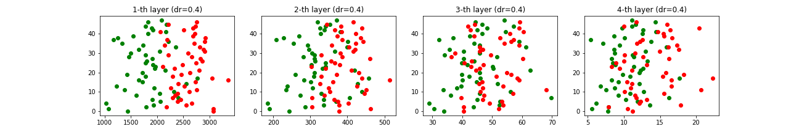

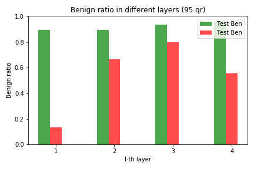
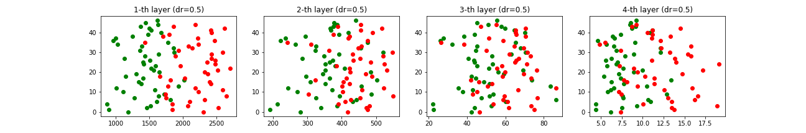
    
    Before the fourth layer 
    
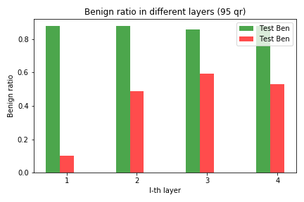
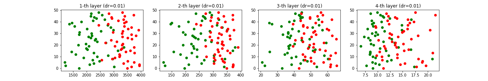 

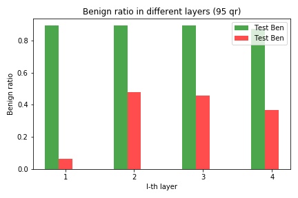
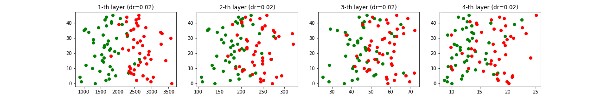

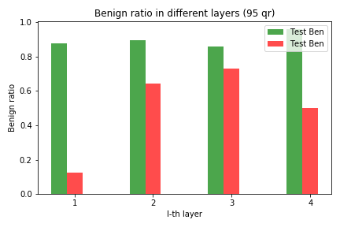
  

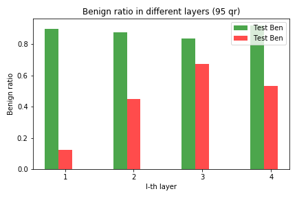
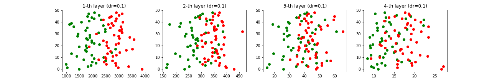

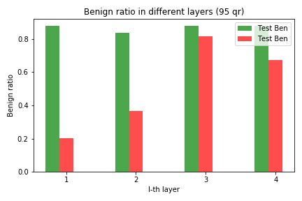
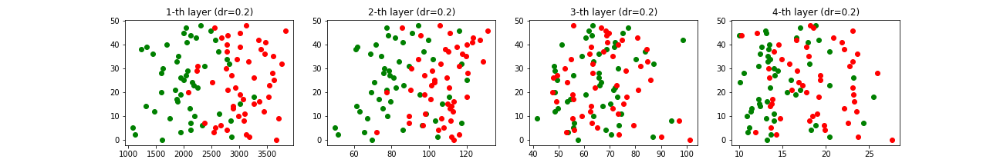

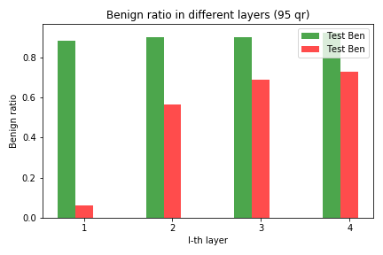
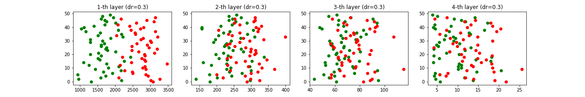

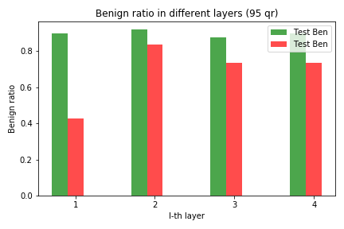
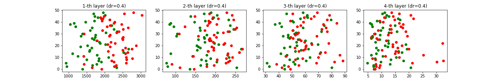

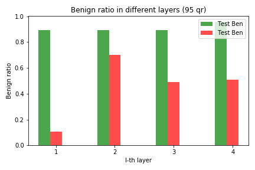
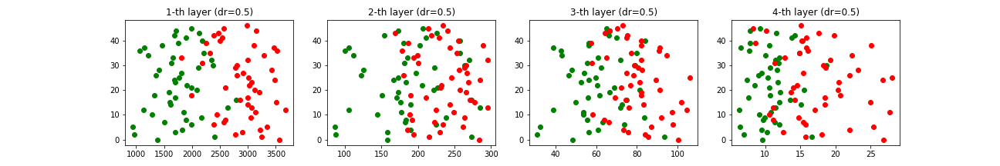

    Current Conclusion (2019 Dec. 3): increasing dropout will make benign and adversarial samples further indistinguishable!!
    It is also noticable that the weights of training and evaluating of models (which involve dropout layer) are different. 
    