    Experiment 12: Relation between PIs and dropout layer (adv_attack=i_FGSM, y/y'=y', model=CNN, qr=95, approach=insertion only)
  
    Before the first layer 
    
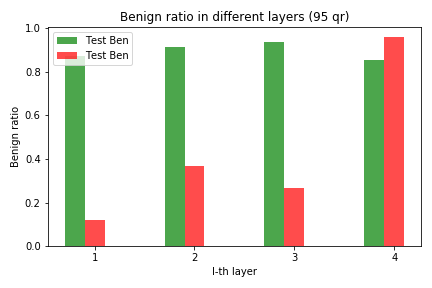
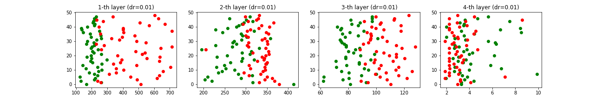 

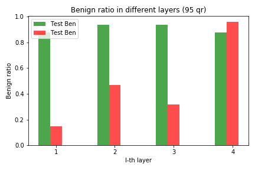
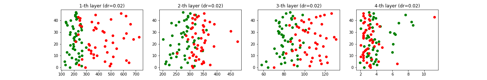 

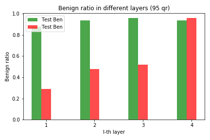
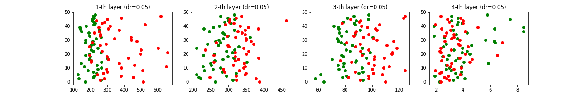

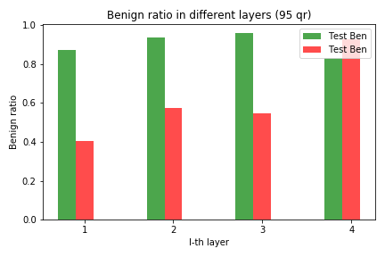
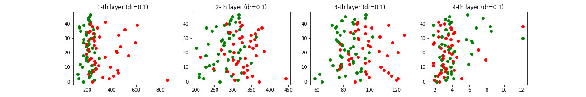

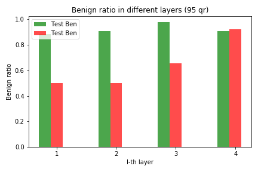
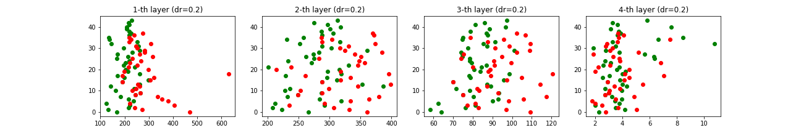

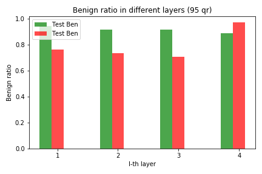
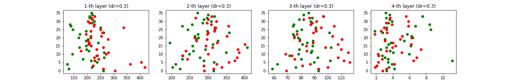

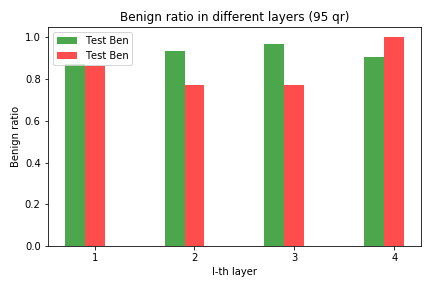
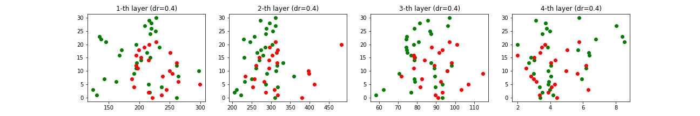

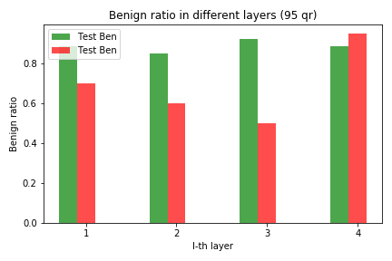
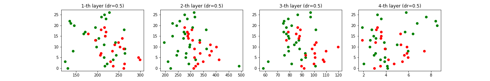

    Before the second layer 
    
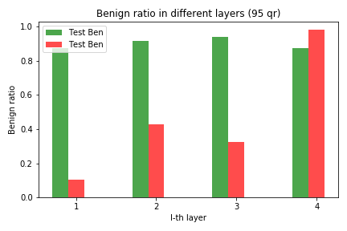
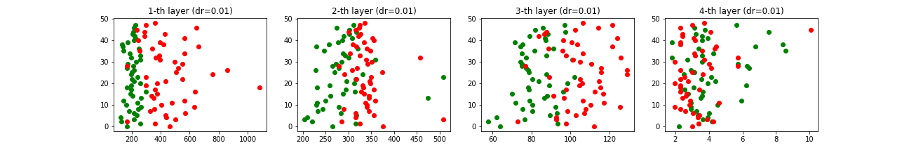 

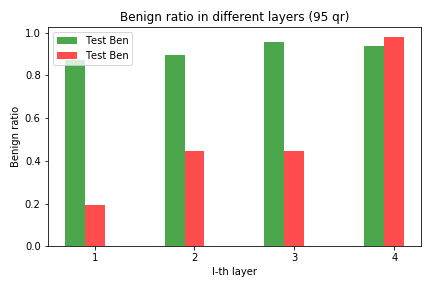
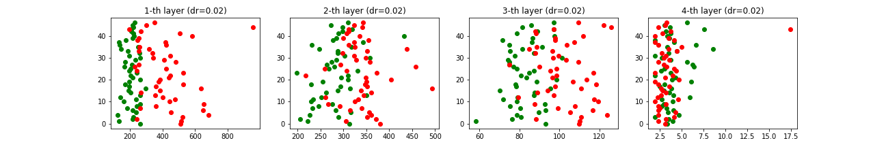 

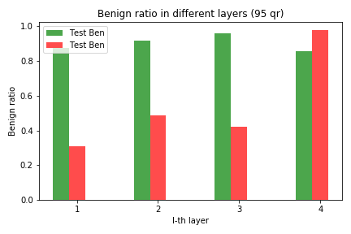
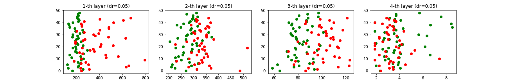

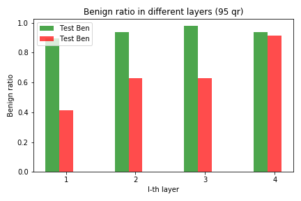
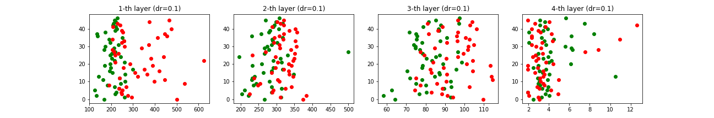

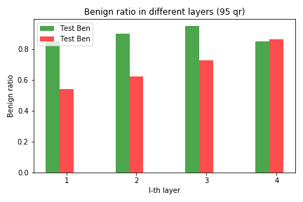
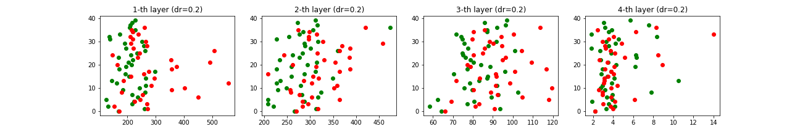

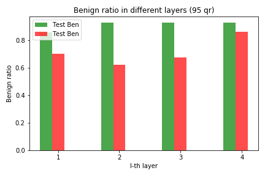
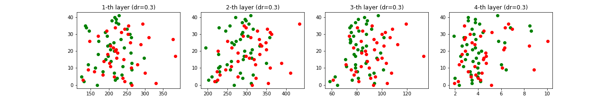

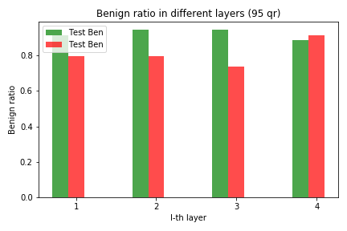
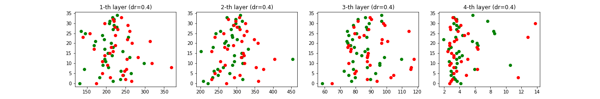

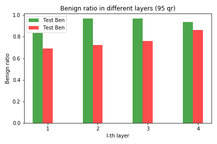
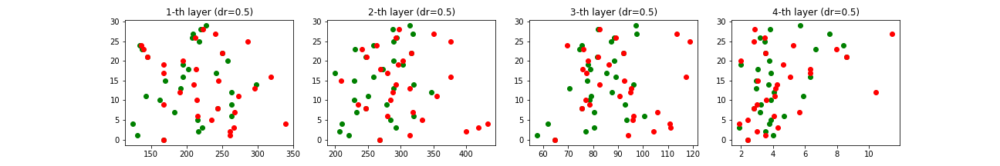

    Before the third layer 
    
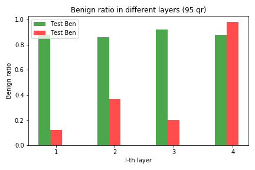
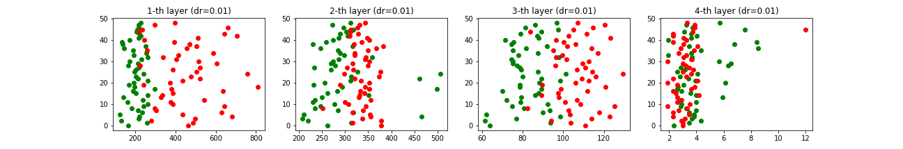 

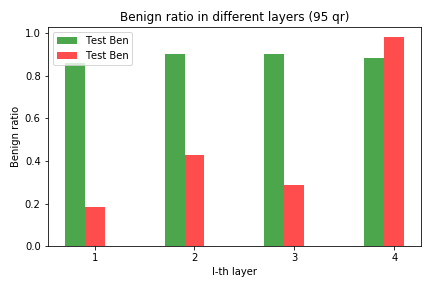
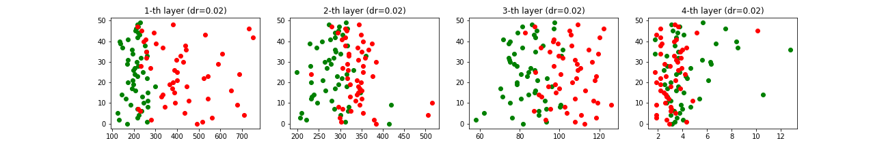 

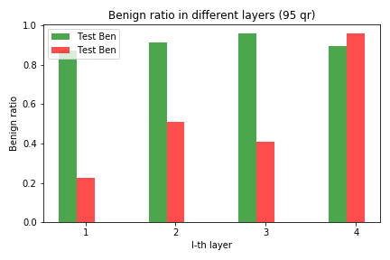
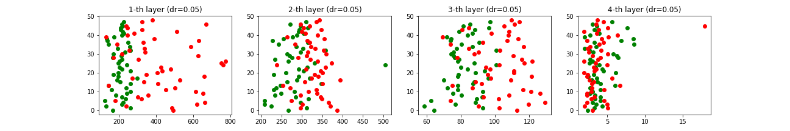

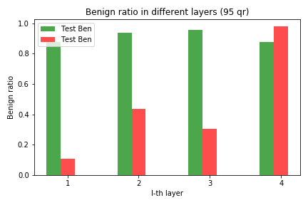
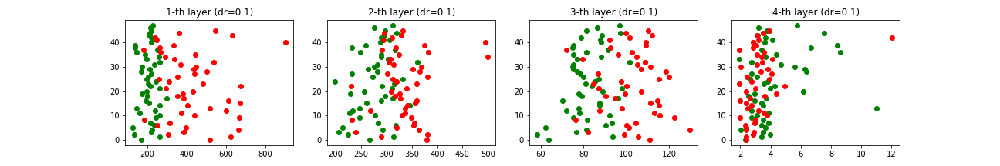

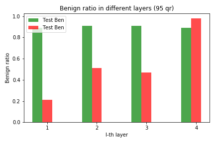
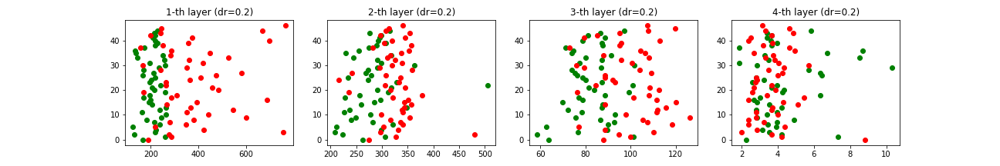

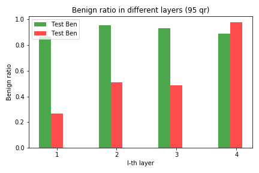
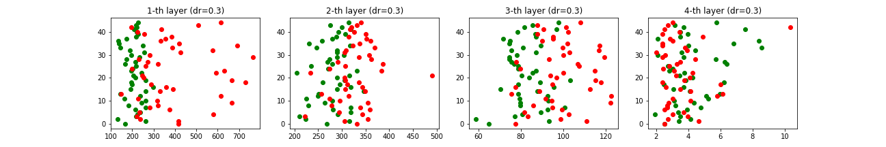

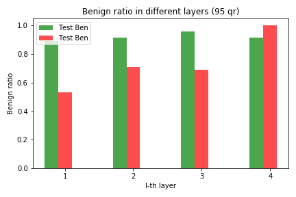
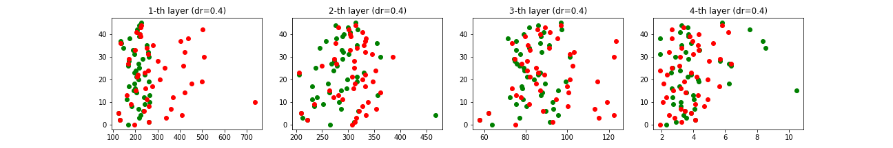

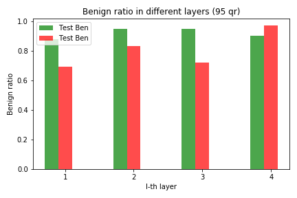
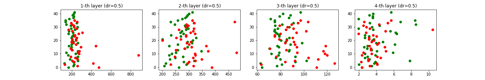

    Before the fourth layer 
    
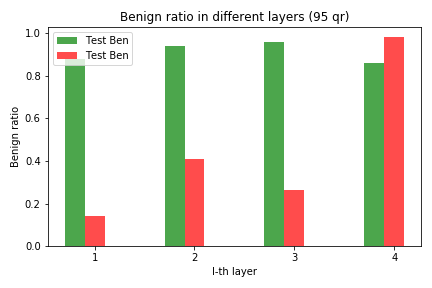
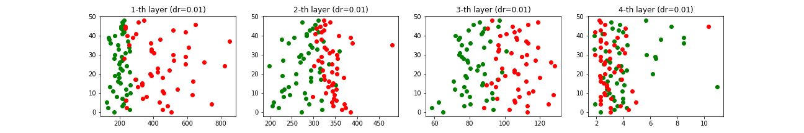 

 

