    Experiment 13: Relation between PIs and dropout layer (adv_attack=i_FGSM, y/y'=y', model=CNN, qr=95, approach=insertion and slight tuning)
  
    Before the first layer 
    
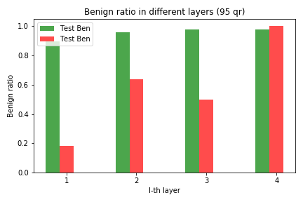
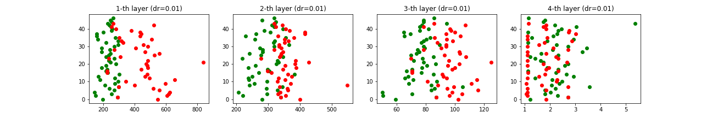

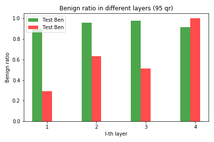
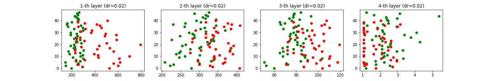 

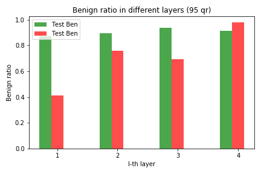
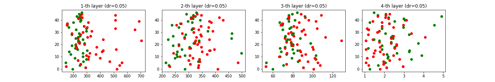 

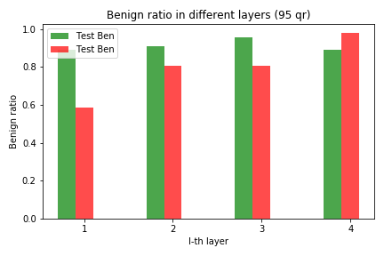
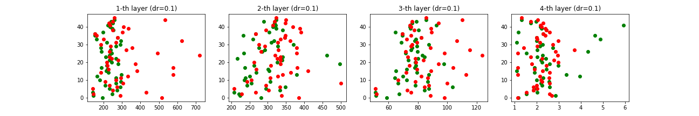 

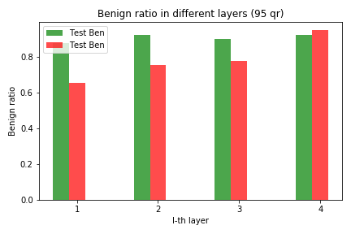
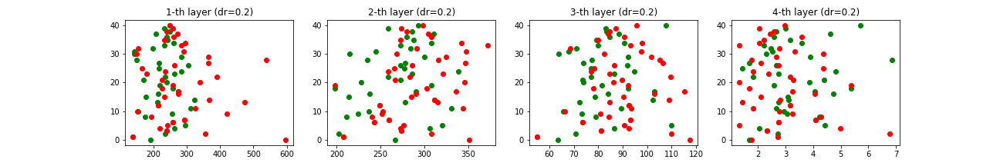 

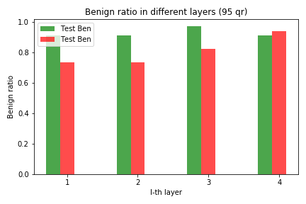
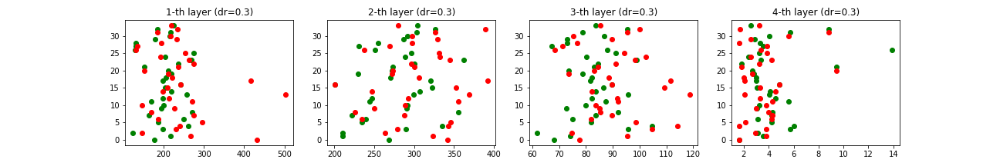 

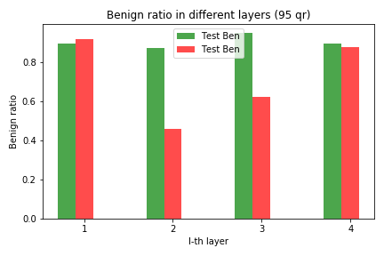
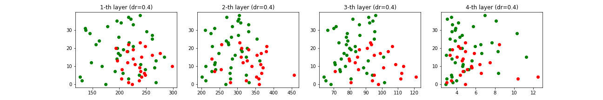 
    
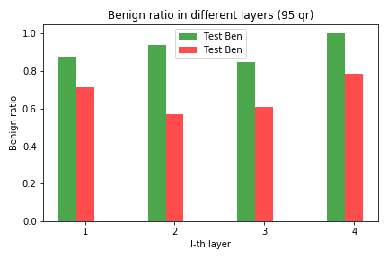
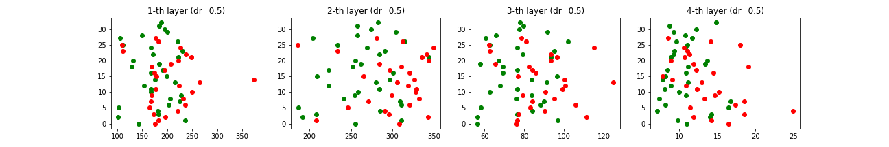 

    Before the second layer 
    

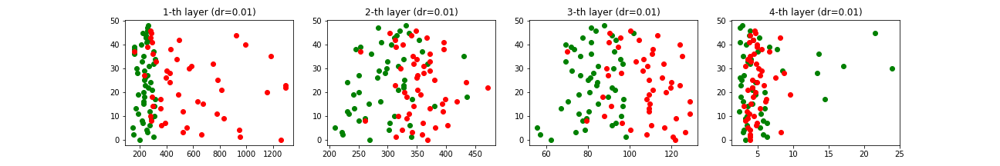

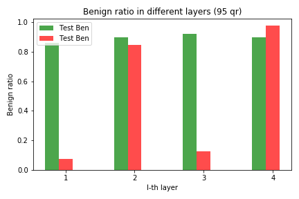
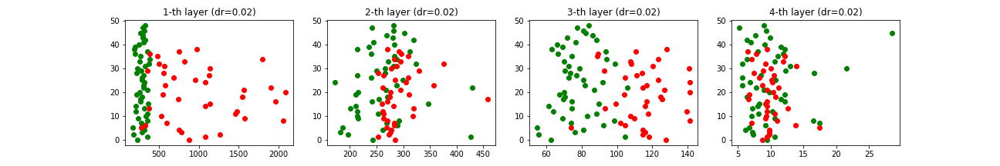 

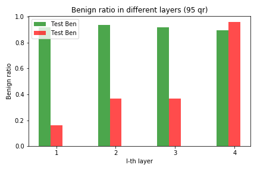
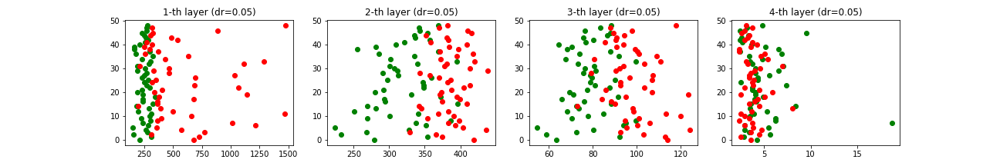 

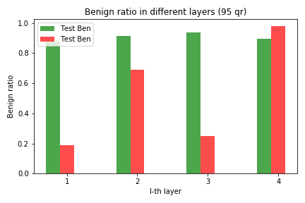
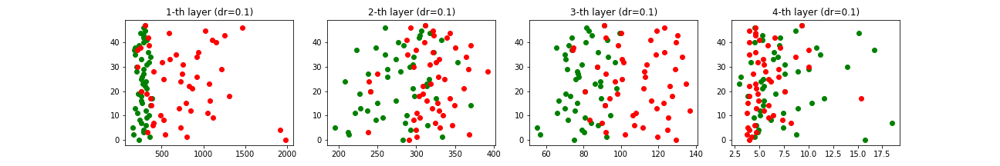 

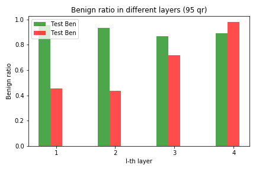
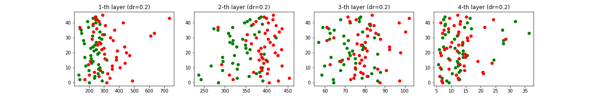 

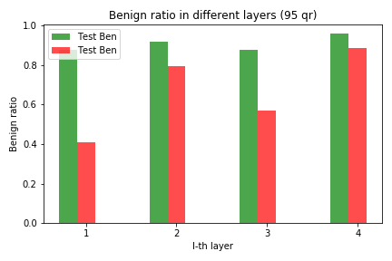
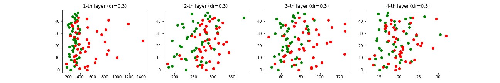 

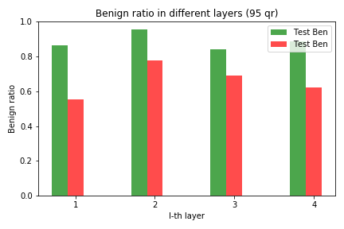
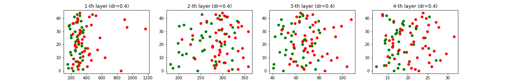 
    
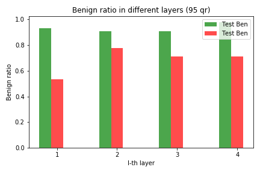
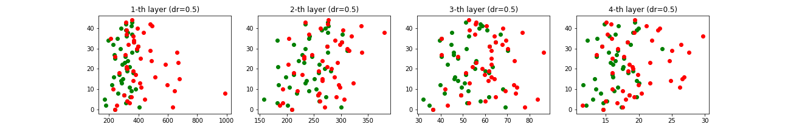  

    Before the third layer 
    
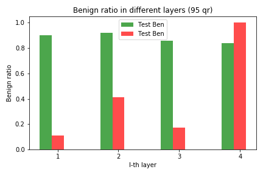
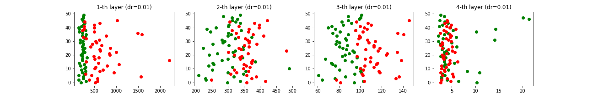

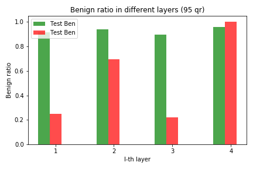
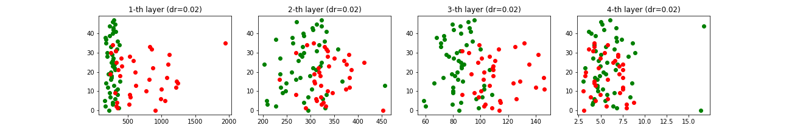 

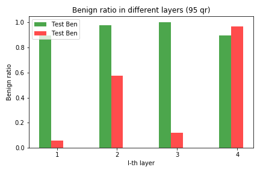
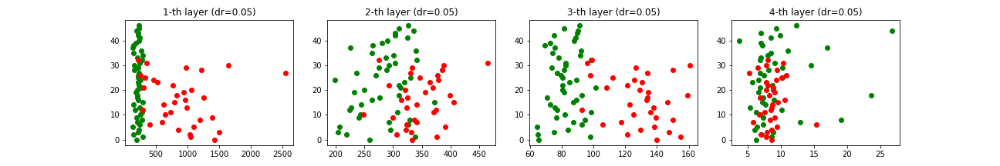 

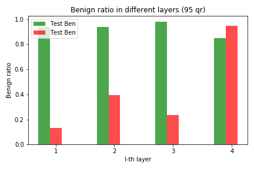
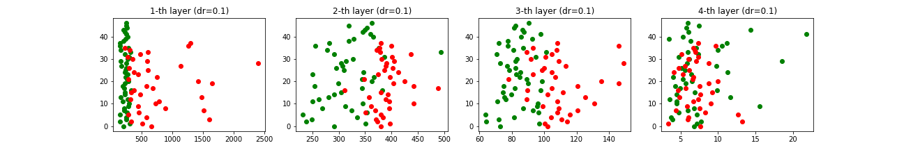 

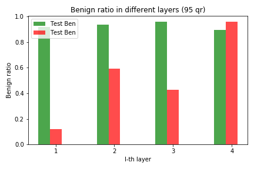
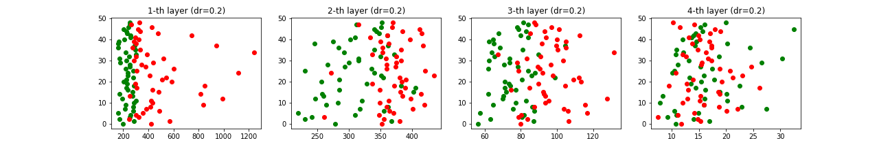 

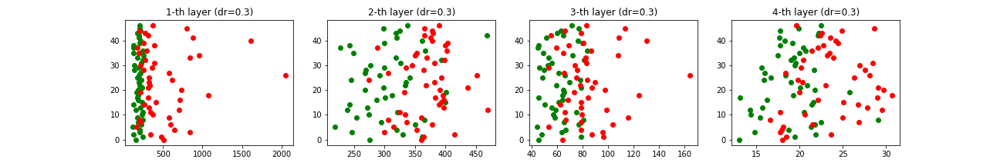 

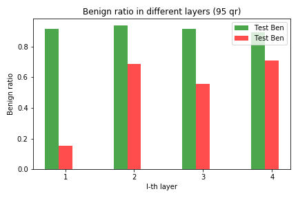
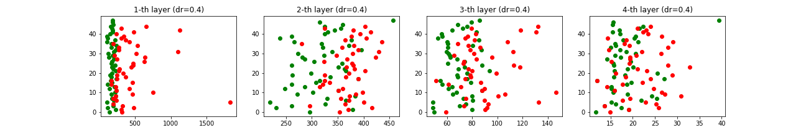 
    
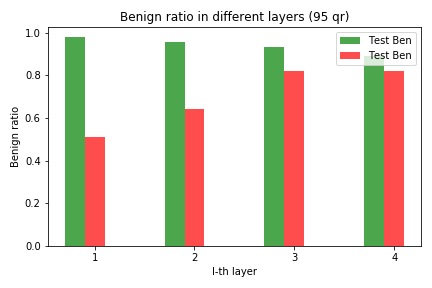
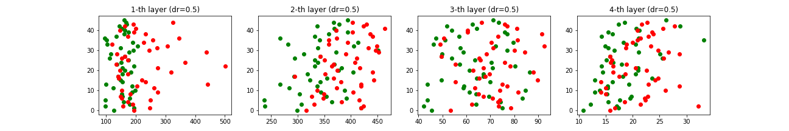  

    Before the fourth layer 
    
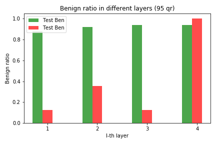
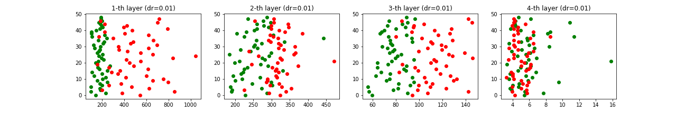

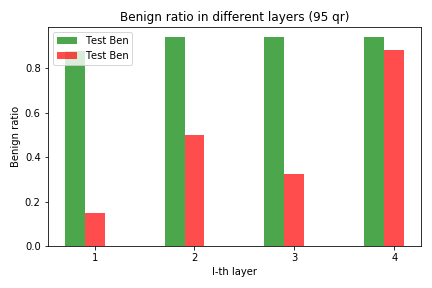
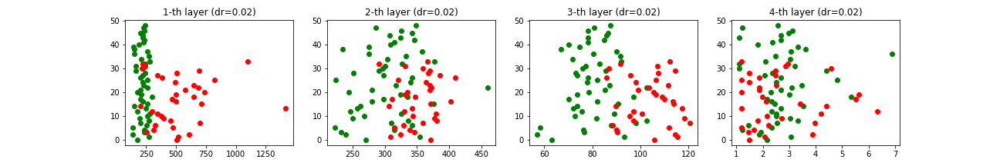 

 

 

 

 

 
    

  