    Experiment 15: Enhanced Relation between PIs and dropout layer, 0.01 interval to 0.2 (adv_attack=i_FGSM, y/y'=y', model=CNN, qr=95, approach=insertion and slight tuning)
  
    Layer: Before the last (FC) layer 
    num_of_train_epoches (twisted): 10
    size_of_train_set: 1000
    size_of_test_set: 100

    
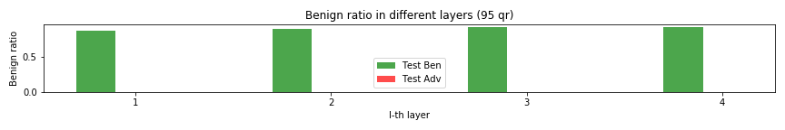
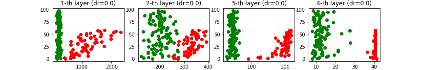

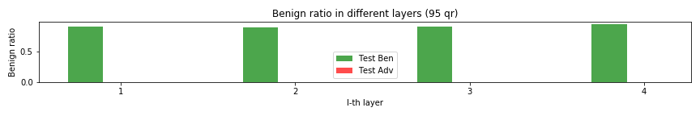
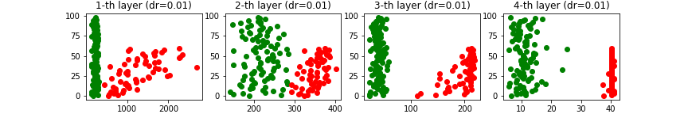

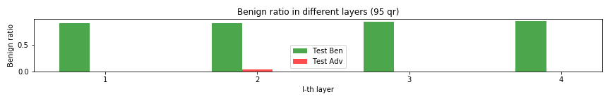
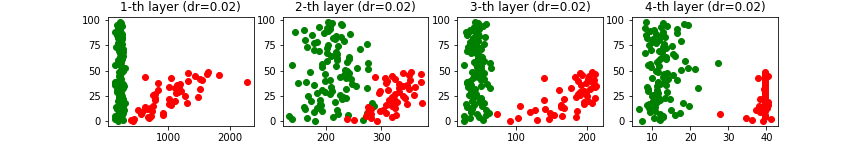

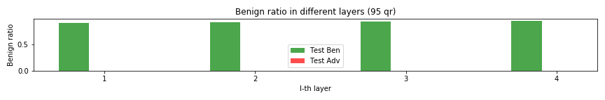
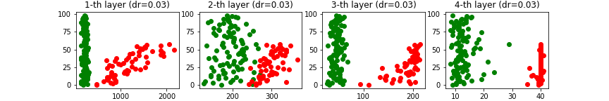

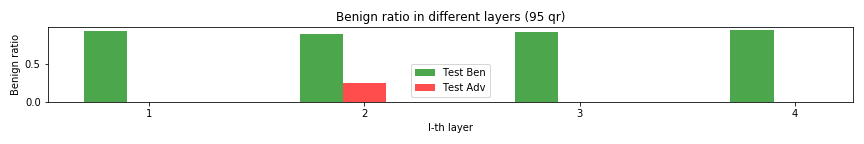
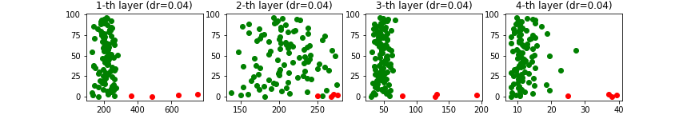

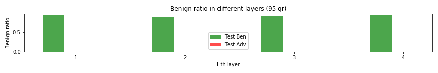
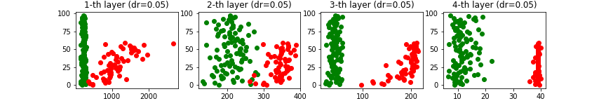

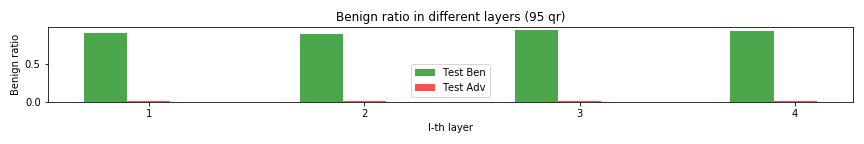
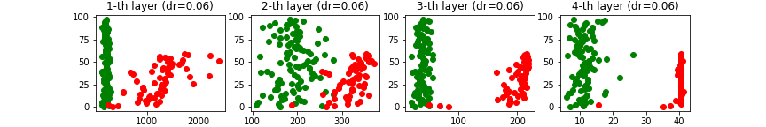

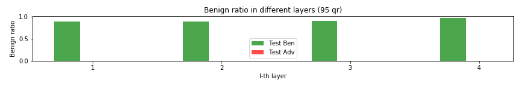
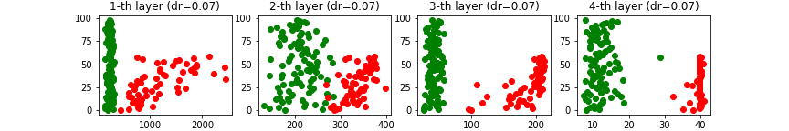

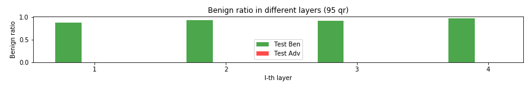
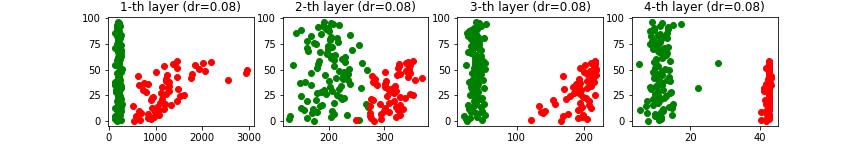

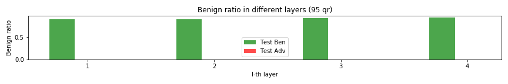
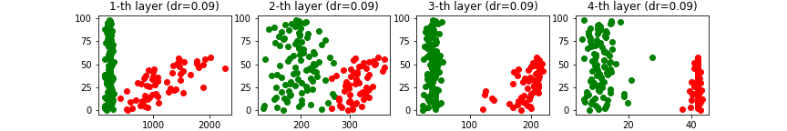

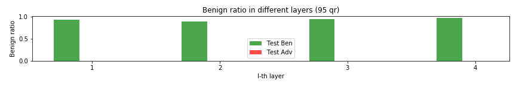
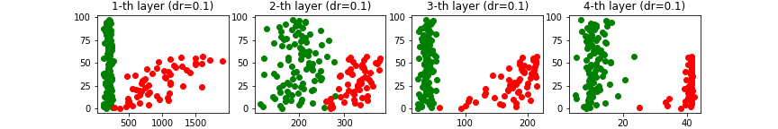

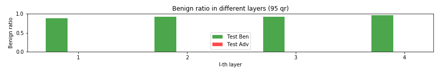
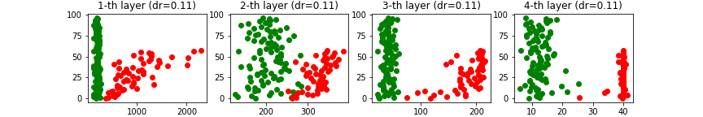

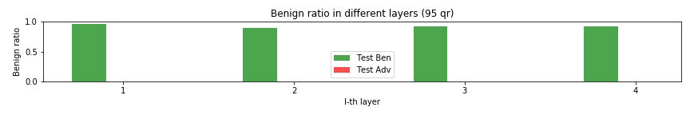
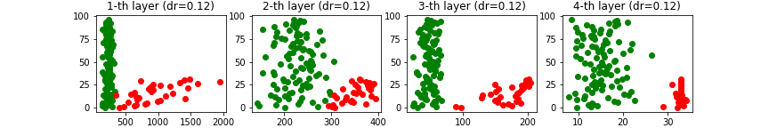

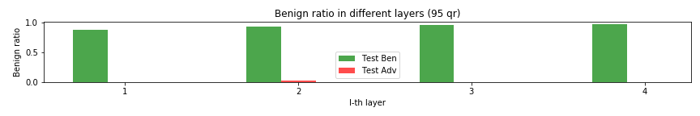
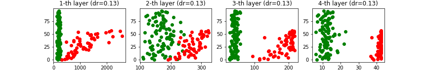

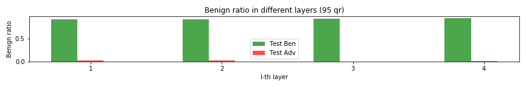
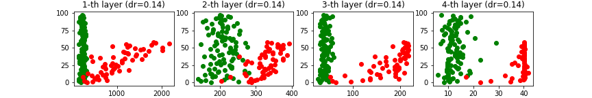

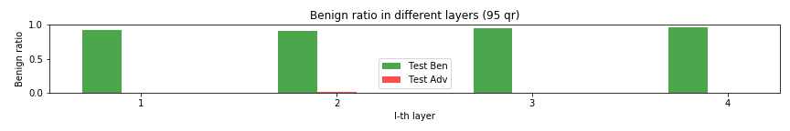
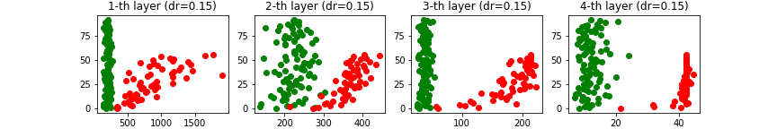

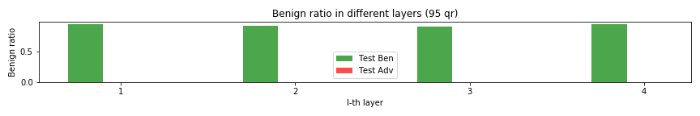
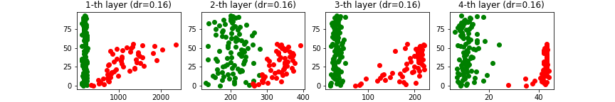

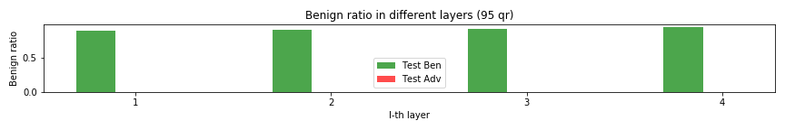
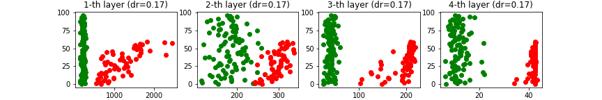

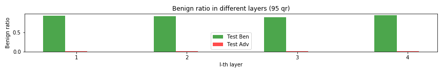
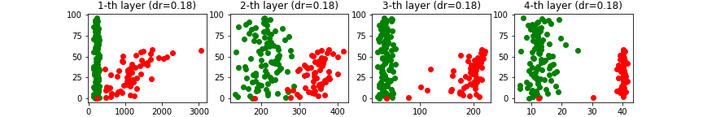

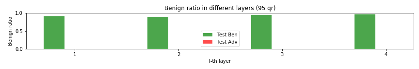
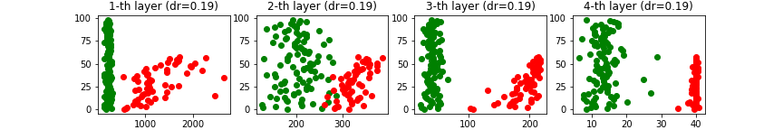

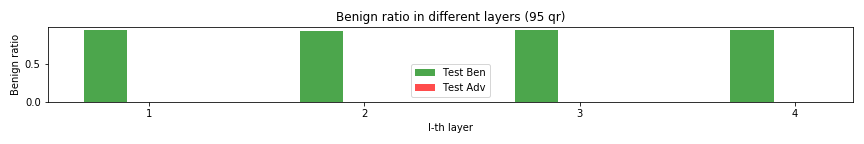
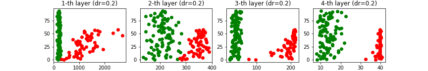