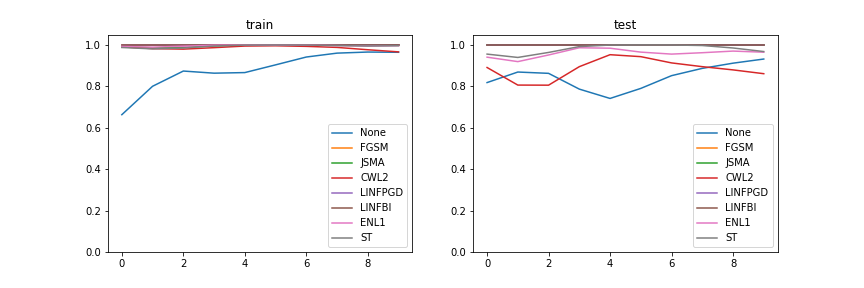
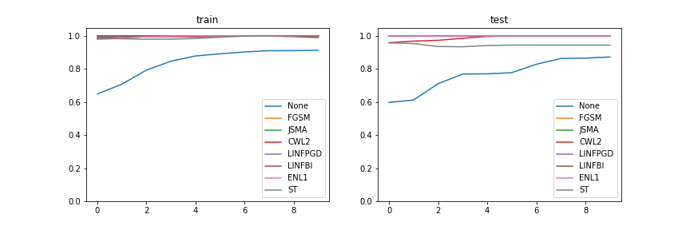
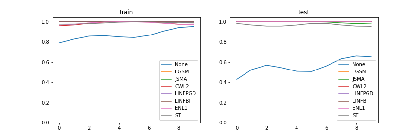
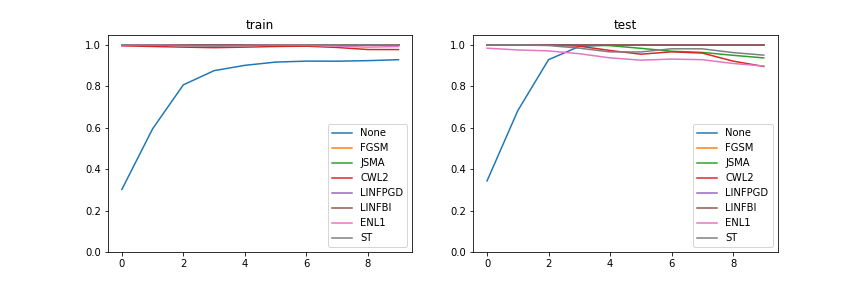
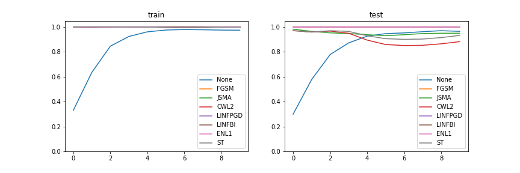
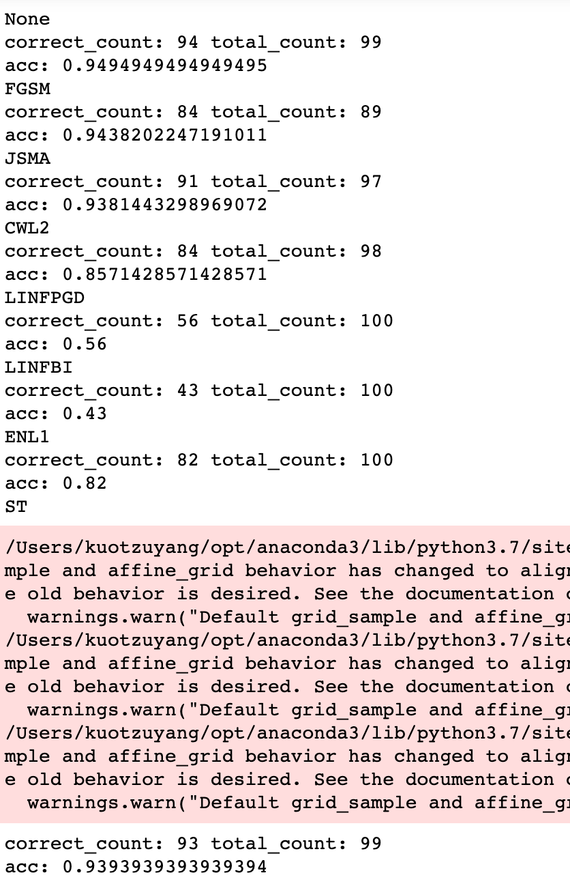

    Here, we would like to train one PPRD for each output class
    Below 10 figures are corresponding to training process of 10 one-PPRD model 

Output class 0  
   
Output class 1  
  
Output class 2  
  
Output class 3  
  
Output class 4  
  
Output class 5  
  
Output class 6  
  
Output class 7  
  
Output class 8  
  
Output class 9  
  

    Architecture for one-PPRD

  
  

    Evaluation (use ground-truth PPRD)

  
  

    Evaluation (use f(adv_x) PPRD)

  

