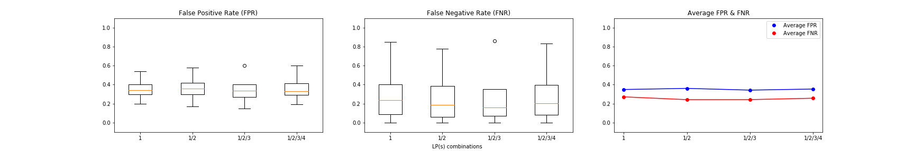
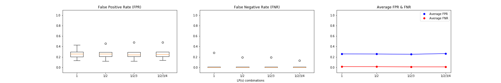
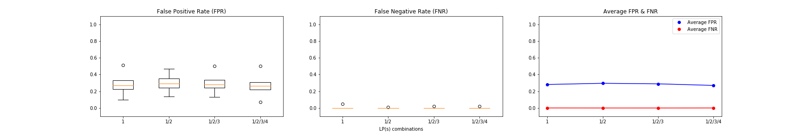

    Experiment 4: Relationship between LP_i combinations and FPR & FNR (adv_a=i_FGSM, y/y'=y)

FPR & FNR of adversarial detection with |S|=500 (LP(s)={1,1/2,1/2/3,1/2/3/4}) 

FPR & FNR of adversarial detection with |S|=1500 (LP(s)={1,1/2,1/2/3,1/2/3/4}) 

FPR & FNR of adversarial detection with |S|=3000 (LP(s)={1,1/2,1/2/3,1/2/3/4}) 

